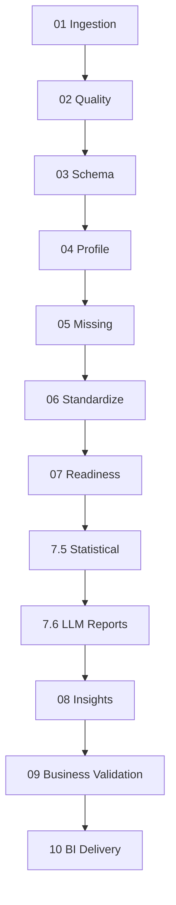

# Mind-Q V4.1 - دليل المراحل المفصل
## Detailed Phases Guide - تفاصيل شاملة لجميع مراحل المعالجة

📅 **آخر تحديث**: أكتوبر 2025  
🎯 **الحالة**: محدّث ومُراجع بالكامل  
🔧 **التطبيق**: Mind-Q V4.1 Pipeline Architecture

---

## 🏗️ نظرة عامة على البنية
**نظام Mind-Q** هو إطار عمل متقدم لهندسة البيانات والتحليلات مصمم خصيصاً لعمليات اللوجستيات والتوصيل. يعالج النظام البيانات عبر **13 مرحلة متطورة** تحول البيانات الخام إلى ذكاء أعمال قابل للتنفيذ مع دعم كامل للغة العربية.

### 📊 مجموعات المراحل الأساسية
1. **أساس البيانات (المراحل 01-04)**: استيعاب وجودة وتخطيط البيانات
2. **التحليلات المتقدمة (المراحل 05-07)**: معالجة البيانات المفقودة والتوحيد القياسي
3. **الذكاء الاصطناعي (المراحل 7.5-8)**: التنميط الإحصائي والرؤى الذكية
4. **ذكاء الأعمال (المراحل 09-10)**: التحقق التجاري وتسليم BI

---

## 📥 المجموعة الأولى: أساس البيانات

### المرحلة 01: الاستيعاب (Ingestion)
**الهدف**: استيعاب متعدد التنسيقات مع معالجة اتفاقيات مستوى الخدمة

#### 🔧 المدخلات المطلوبة:
```json
{
  "data_files": ["path/to/data.csv", "path/to/data.parquet"],
  "sla_files": ["path/to/sla.pdf", "path/to/sla.xlsx"] // اختياري
}
```

#### ⚙️ المعالجة الأساسية:
- **كشف أعمدة الهاتف**: استخدام regex متقدم لكشف أرقام الهواتف
- **تطبيع البيانات**: توحيد تنسيقات CSV/Parquet مع Polars
- **معالجة SLA**: استخراج المصطلحات والعتبات من ملفات PDF/DOCX/Excel
- **إنشاء البصمة**: hash للهيكل وبصمة المصدر

#### 📄 المخرجات:
```
artifacts/{run_id}/stage_01_ingestion/
├── raw.parquet              # البيانات الموحدة
├── meta_ingestion.json      # بيانات وصفية شاملة
├── missing_summary.json     # ملخص البيانات المفقودة
├── sla_manifest.json        # فهرس اتفاقيات SLA
└── baselines.json           # خطوط الأساس للمقارنة
```

#### 🚨 نقاط التحقق الحرجة:
- **الحد الأدنى للصفوف**: فشل إذا كانت < min_rows_required
- **التحقق من تنسيق الملف**: دعم CSV/Parquet/Excel
- **كشف PII**: حماية البيانات الشخصية الحساسة

---

### المرحلة 02: الجودة (Quality)
**الهدف**: بوابات جودة وكتالوجات المشاكل وخطوط الأساس

#### 🔧 المدخلات:
```json
{
  "raw": "artifacts/{run_id}/stage_01_ingestion/raw.parquet"
}
```

#### ⚙️ فحوصات الجودة المتقدمة:
- **حراس الصفوف**: تحقق من تكامل البيانات
- **إحصائيات النقص**: تحليل البيانات المفقودة
- **مقارنة hash المخطط**: كشف انحراف الهيكل
- **كشف non-ASCII**: تحديد مشاكل التشفير
- **كشف التواريخ المستقبلية**: فحص صحة الطوابع الزمنية

#### 📊 المقاييس المُجمعة:
```json
{
  "total_rows": 15420,
  "missing_percentage": 12.3,
  "non_ascii_columns": ["customer_name", "address"],
  "future_timestamps": 0,
  "quality_score": 87.5
}
```

#### 📄 المخرجات:
```
artifacts/{run_id}/stage_02_quality/
├── quality_report.json      # تقرير الجودة الأساسي
├── issues_catalog.json      # كتالوج المشاكل المكتشفة
├── row_guards_result.json   # نتائج حراس الصفوف
└── baselines_comparison.json # مقارنة خطوط الأساس
```

---

### المرحلة 03: المخطط (Schema)
**الهدف**: استخراج المخطط وكشف الانحراف

#### ⚙️ معالجة المخطط:
- **استخراج التعريفات**: أنواع البيانات والقيود
- **كشف الانحراف**: مقارنة مع خطوط الأساس
- **التحقق من الصفوف**: مطابقة العدد المتوقع
- **حماية العمود**: تحديد الأعمدة المحمية

#### 📄 المخرجات:
```
artifacts/{run_id}/stage_03_schema/
├── schema_v1.json           # تعريف المخطط الكامل
├── drift_detection.json     # تقرير انحراف المخطط
└── protected_columns.json   # قائمة الأعمدة المحمية
```

---

### المرحلة 04: التنميط (Profile)
**الهدف**: تنميط خفيف الوزن وتناسق عدد الصفوف

#### 📊 تحليل التنميط:
- **إحصائيات أساسية**: min, max, mean, std
- **توزيعات البيانات**: histograms للأعمدة الرقمية
- **اكتشاف الشذوذ**: القيم الشاذة باستخدام IQR
- **حارس تناسق الصفوف**: التحقق من ثبات العدد

#### 📄 المخرجات:
```
artifacts/{run_id}/stage_04_profile/
├── row_meta.json            # بيانات وصفية للصفوف
├── profile_summary.json     # ملخص التنميط الكامل
└── distribution_stats.json  # إحصائيات التوزيع
```

---

## 🔧 المجموعة الثانية: التحليلات المتقدمة

### المرحلة 05: البيانات المفقودة (Missing Values)
**الهدف**: استيفاء هجين ومجمّع مع مراقبة PSI

#### 🔧 استراتيجيات الاستيفاء المتقدمة:
- **استيفاء مجمّع**: بناء على مجموعات العملاء
- **استيفاء زمني**: مراعاة الاتجاهات الزمنية
- **مراقبة PSI**: Population Stability Index
- **مؤشرات البيانات المفقودة**: أعمدة إضافية للتتبع

#### ⚙️ تكوين السياسة:
```yaml
# contracts/impute/policy.yml
imputation:
  strategy: "groupwise"
  numeric_method: "median"
  categorical_method: "mode"
  time_aware: true
  psi_threshold: 0.2
```

#### 📄 المخرجات:
```
artifacts/{run_id}/stage_05_missing/
├── imputed.parquet          # البيانات بعد الاستيفاء
├── imputation_log.json      # سجل عمليات الاستيفاء
├── psi_monitoring.json      # مراقبة PSI
└── missing_indicators.json  # مؤشرات البيانات المفقودة
```

---

### المرحلة 06: التوحيد القياسي (Standardization)
**الهدف**: هندسة الخصائص مع إدارة الاستبعاد

#### 🔧 معالجة التوحيد القياسي:
- **تطبيق العمود المحمي**: الحفاظ على الأعمدة الحرجة
- **تطبيق الاستبعاد**: إزالة الخصائص غير المرغوبة
- **تطبيع الخصائص**: Z-score standardization
- **إنشاء خصائص مشتقة**: تحسينات منطق الأعمال

#### 📊 هندسة الخصائص المتقدمة:
```python
# مثال على الخصائص المشتقة
features = {
    "delivery_time_hours": "DATEDIFF(delivered_at, shipped_at) / 24",
    "distance_ratio": "actual_distance / planned_distance",
    "cost_per_km": "delivery_cost / actual_distance"
}
```

#### 📄 المخرجات:
```
artifacts/{run_id}/stage_06_standardize/
├── features.curated.parquet  # الخصائص المنسقة
├── features.parquet         # جميع الخصائص
├── excluded_features.json   # الخصائص المستبعدة
└── standardization_log.json # سجل التوحيد القياسي
```

---

### المرحلة 07: الجاهزية (Readiness)
**الهدف**: كشف التسرب والارتباط وتحليل NZV

#### 🔍 تحليل الجاهزية المتقدم:
- **كشف تسرب البيانات**: منع المعلومات المستقبلية
- **تحليل الارتباط**: Pearson/Spearman matrices
- **تحليل NZV**: Near Zero Variance detection
- **تحليل العتبات**: تحديد نقاط القطع المثلى

#### 📊 مصفوفة الارتباط:
```json
{
  "correlation_matrix": {
    "delivery_time": {
      "distance": 0.85,
      "traffic_score": 0.62,
      "weather_impact": 0.34
    }
  },
  "high_correlation_pairs": [
    ["delivery_time", "distance", 0.85]
  ]
}
```

#### 📄 المخرجات:
```
artifacts/{run_id}/stage_07_readiness/
├── correlation_matrix.json   # مصفوفة الارتباط
├── leakage_detection.json   # تقرير كشف التسرب
├── nzv_analysis.json        # تحليل NZV
└── readiness_score.json     # نقاط الجاهزية
```

---

## 🤖 المجموعة الثالثة: الذكاء الاصطناعي

### المرحلة 7.5: التنميط الإحصائي (Statistical Profiling)
**الهدف**: تنميط شامل مع حماية PII

#### 🔒 حماية الخصوصية:
- **كشف PII متعدد الطبقات**: هواتف، إيميلات، بيانات شخصية
- **إخفاء البيانات الحساسة**: tokenization للحقول الحساسة
- **تحليل إحصائي آمن**: بدون كشف البيانات الأصلية

#### 📄 المخرجات:
```
artifacts/{run_id}/stage_07_5_statistical/
├── secure_profile.json      # التنميط الآمن
├── pii_detection.json       # كشف البيانات الشخصية
└── statistical_summary.json # الملخص الإحصائي
```

---

### المرحلة 7.6: التقارير الذكية بـ LLM
**الهدف**: تقارير أعمال باللغة العربية مدعومة بـ LLM

#### 🤖 قدرات LLM المتقدمة:
- **تلخيص ذكي**: تقارير سردية باللغة العربية
- **اكتشاف الأنماط**: رؤى تلقائية من البيانات
- **توصيات الأعمال**: اقتراحات قابلة للتنفيذ
- **تحسين التكلفة**: عد الرموز واختيار المزود

#### 📋 مثال تقرير عربي:
```json
{
  "business_summary": "تُظهر البيانات تحسناً في أوقات التسليم بنسبة 15% خلال الشهر الماضي، مع تركز التأخيرات في منطقة الرياض بسبب الازدحام المروري.",
  "key_insights": [
    "معدل النجاح في التسليم اليومي: 94.2%",
    "متوسط وقت التسليم: 2.4 ساعة",
    "المناطق الأكثر تحدياً: الرياض، جدة، الدمام"
  ],
  "recommendations": [
    "تعزيز فرق التسليم في ساعات الذروة",
    "تحسين خوارزميات التوجيه للمناطق المزدحمة"
  ]
}
```

---

### المرحلة 08: الرؤى (Insights)
**الهدف**: رؤى تشغيلية وتشخيصات وبطاقات سردية

#### 📊 محرك الرؤى المتقدم:
- **تحليل الاتجاهات**: اكتشاف الأنماط الزمنية
- **كشف الشذوذ**: القيم الشاذة والسلوكيات غير المعتادة
- **تحليل السببية**: فهم العلاقات السببية
- **بطاقات سردية**: تفسيرات قابلة للفهم

#### 🎯 مقاييس الأداء الرئيسية:
```json
{
  "operational_insights": {
    "delivery_efficiency": 92.1,
    "cost_optimization": 15.3,
    "customer_satisfaction": 4.7,
    "route_optimization": 88.9
  },
  "trend_analysis": {
    "weekly_improvement": "+3.2%",
    "seasonal_patterns": "ذروة خلال رمضان",
    "bottlenecks": ["منطقة الرياض", "ساعات الذروة"]
  }
}
```

#### 📄 المخرجات:
```
artifacts/{run_id}/stage_08_insights/
├── insights_report.json     # تقرير الرؤى الأساسي
├── trend_analysis.json      # تحليل الاتجاهات
├── anomaly_detection.json   # كشف الشذوذ
├── narrative_cards.json     # البطاقات السردية
└── causality_analysis.json  # تحليل السببية
```

---

## 🎯 المجموعة الرابعة: ذكاء الأعمال

### المرحلة 09: التحقق التجاري (Business Validation)
**الهدف**: التحقق من SLA وحل الكيانات والقرارات

#### ✅ عمليات التحقق الشاملة:
- **مطابقة SLA**: مقارنة الأداء مع الاتفاقيات
- **حل الكيانات**: توحيد سجلات العملاء
- **التحقق من KPI**: مقاييس الأداء الرئيسية
- **قرارات الأعمال**: توصيات تلقائية

#### 📈 مؤشرات SLA الأساسية:
```json
{
  "sla_compliance": {
    "delivery_time_sla": {
      "target": "< 4 hours",
      "actual": "3.2 hours",
      "compliance": 98.5,
      "status": "PASS"
    },
    "success_rate_sla": {
      "target": "> 95%",
      "actual": "97.1%",
      "compliance": 102.2,
      "status": "PASS"
    }
  }
}
```

#### 📄 المخرجات:
```
artifacts/{run_id}/stage_09_business_validation/
├── sla_compliance.json      # امتثال اتفاقيات SLA
├── entity_resolution.json   # حل الكيانات
├── kpi_validation.json      # التحقق من KPIs
├── business_decisions.json  # قرارات الأعمال
└── export_manifest.json     # فهرس التصدير
```

---

### المرحلة 10: تسليم BI (Business Intelligence Delivery)
**الهدف**: مخازن دلالية ومساعد BI ومتاجر البيانات

#### 🏢 بنية BI المتقدمة:
- **المتاجر الدلالية**: بيانات منظمة للتحليل
- **metrics.yaml**: تعريفات المقاييس المعيارية
- **مساعد BI**: واجهة تفاعلية باللغة العربية
- **لوحات تحكم تفاعلية**: رؤى بصرية في الوقت الفعلي

#### 📊 متاجر البيانات الدلالية:
```yaml
# metrics.yaml
metrics:
  - id: delivery_sla_compliance
    name: "امتثال SLA التسليم"
    sql: |
      SELECT 
        AVG(CASE WHEN delivery_time <= sla_threshold THEN 1.0 ELSE 0.0 END) * 100 as sla_compliance
      FROM fact_deliveries
    unit: "percentage"
    direction: "higher_is_better"
    
  - id: cost_per_delivery
    name: "تكلفة التسليم"
    sql: |
      SELECT AVG(delivery_cost) as avg_cost
      FROM fact_deliveries
    unit: "SAR"
    direction: "lower_is_better"
```

#### 🤖 مساعد BI التفاعلي:
- **استعلامات باللغة العربية**: "كم متوسط وقت التسليم هذا الأسبوع؟"
- **رؤى تلقائية**: تحليل الاتجاهات والأنماط
- **تصورات ديناميكية**: رسوم بيانية تفاعلية
- **تقارير مجدولة**: تحديثات دورية للإدارة

#### 📄 المخرجات النهائية:
```
artifacts/{run_id}/stage_10_bi/
├── fact_business.parquet    # جدول الحقائق الأساسي
├── dim_customers.parquet    # بُعد العملاء
├── dim_geography.parquet    # البُعد الجغرافي
├── metrics.yaml            # تعريفات المقاييس
├── semantic_payload.yaml   # الحمولة الدلالية
├── bi_assistant_config.json # تكوين مساعد BI
└── dashboard_templates/    # قوالب لوحات التحكم
    ├── executive_summary.json
    ├── operational_kpis.json
    └── financial_overview.json
```

---

## 🔄 تدفق التكامل والتبعيات

### خريطة التبعيات:


### نقاط التحكم الحرجة:
- **01→02**: التحقق من جودة البيانات الأولية
- **05→06**: ضمان اكتمال الاستيفاء
- **07→08**: جاهزية البيانات للتحليل
- **09→10**: التحقق من امتثال SLA

---

## 🚀 تشغيل النظام

### تشغيل مرحلة واحدة:
```bash
# تشغيل المرحلة 01
curl -X POST http://localhost:9000/v1/runs/demo/phases/01/ingestion \
  -H "Content-Type: application/json" \
  -d '{
    "data_files": ["data/logistics_data.csv"],
    "sla_files": ["contracts/sla_document.pdf"]
  }'
```

### تشغيل النظام الكامل:
```powershell
# تشغيل جميع المراحل
python -m cli.runner flow --run-id production-run --csv "data/operational_data.csv"
```

### مراقبة التقدم:
```bash
# التحقق من حالة التشغيل
curl http://localhost:9000/v1/runs/demo/pipeline/status
```

---

## 📋 قوائم التحقق والمراجعة

### قائمة تحقق ما قبل الإنتاج:
- [ ] التحقق من صحة ملفات البيانات
- [ ] مراجعة تكوين SLA
- [ ] اختبار الاتصال بـ LLM
- [ ] التحقق من مساحة التخزين
- [ ] مراجعة إعدادات الأمان

### قائمة تحقق ما بعد التشغيل:
- [ ] مراجعة تقارير الجودة
- [ ] التحقق من امتثال SLA
- [ ] فحص سجلات الأخطاء
- [ ] تحديث خطوط الأساس
- [ ] نشر لوحات التحكم

---

## 🔧 استكشاف الأخطاء وإصلاحها

### مشاكل شائعة وحلولها:

#### خطأ في المرحلة 01:
```
Error: "too_few_rows"
الحل: التحقق من min_rows_required في التكوين
```

#### خطأ في المرحلة 06:
```
Error: "Server error '500 Internal Server Error' for OpenAI API"
الحل: التحقق من مفاتيح API وحدود الاستخدام
```

#### خطأ في المرحلة 08:
```
Error: "unsupported operand type(s) for /: 'str' and 'int'"
الحل: التحقق من أنواع البيانات في العمليات الحسابية
```

---

## 📚 مراجع إضافية

### وثائق تقنية:
- [BRD.md](./BRD.md) - متطلبات الأعمال
- [PIPELINE_API.md](./PIPELINE_API.md) - توثيق API
- [SLA_PIPELINE.md](./SLA_PIPELINE.md) - معالجة SLA

### أدلة التطوير:
- [DEVELOPER_GUIDE.md](./DEVELOPER_GUIDE.md) - دليل المطور
- [CORRELATION_SAMPLING_ANALYSIS.md](./CORRELATION_SAMPLING_ANALYSIS.md) - تحليل العينات

---

**📞 الدعم التقني**: للحصول على مساعدة إضافية، راجع الوثائق التقنية أو تواصل مع فريق التطوير.

**🔄 آخر تحديث**: تم تحديث هذا الدليل ليعكس أحدث تطورات Mind-Q V4.1 مع دعم كامل للغة العربية ومعالجة متقدمة للبيانات اللوجستية.