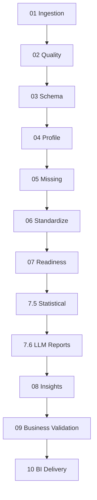

# Mind-Q V4.1 - Detailed Phase Guide
## Detailed Phases Guide

📅 **Last Updated**: October 2025  
🎯 **Status**: Fully refreshed and reviewed  
🔧 **Applies To**: Mind-Q V4.1 Pipeline Architecture

---

## 🏗️ Architecture Overview
The **Mind-Q** platform is an end-to-end data engineering and analytics framework tailored for logistics and delivery operators. The production controller currently executes the following pipeline order (aligned with `PIPELINE_PHASE_SEQUENCE` in `backend/src/app/services/pipeline_api/app.py`): `01_ingestion → 02_quality → 03_schema → 03_5_textops → 04_profile → 05_missing → 06_standardize → 07_readiness → 07_5_feature_report → 07_6_llm_summary → 07_7_business_correlations → 07_analytics → 07_timeseries → 07_knime_bridge → 08_insights → 09_business_validation → 09_5_causal → 10_bi → 12_routing`. Each optional phase (TextOps, analytics/timeseries, causal advisory, routing) is now part of the official flow and is toggled via explicit CLI/API flags, so the progress tracker always reveals when a step is skipped versus executed.

### 📊 Core Phase Groups
1. **Data Foundation (Stages 01-04)**: ingestion, quality, schema, profiling  
2. **Advanced Analytics (Stages 05-07)**: imputation, standardization, readiness, analytics  
3. **AI & Insights (Stages 7.5-8)**: statistical feature reporting, LLM summaries, insight generation  
4. **Business Intelligence (Stages 09-10)**: business validation, BI delivery (with optional advisory add-ons such as Stage 09.5 causal and Stage 12 routing when invoked manually)

---

## 📚 Documentation Structure Per Stage
Each phase in this guide follows the same analytical frame so updates stay consistent and comparable across the logistics pipeline:

1. **Stage Definition** — concise overview of what the phase does.
2. **Business Objective** — why the phase matters for logistics KPIs and SLAs.
3. **Operational Mechanics** — how the current code path executes, with pointers to key files or functions.
4. **Inter-Stage Relationships** — upstream dependencies and downstream consumers.
5. **Outputs & Reports** — materialized artifacts, diagnostics, and contract files.
6. **Core Libraries & Components** — critical packages, utilities, or design patterns used by the implementation.
7. **Future Enhancements (ML & Data Science)** — prioritized ideas for evolution grounded in logistics analytics and machine learning.

Feel free to reuse this structure when documenting enhancements or reviewing other phases.

---

## 📥 Phase Group 1: Data Foundation

### Stage 01: Ingestion

#### Stage Definition
Stage 01 ingests heterogeneous logistics source files (CSV, Parquet, Excel exports) and normalizes them into a unified operational dataset. It also curates SLA documents so they can be reasoned about in later phases.

#### Implementation Status
- Status: Implemented
- Evidence: `phases/01_ingestion/impl.py`, `backend/src/app/services/pipeline_api/app.py#L173`
- Last checked: {{TO_FILL_DATE}}

#### Quality Gates & STOP/WARN
- STOP when any source file falls below `min_file_size_bytes` or the combined frame has fewer rows than `min_rows` (`phases/01_ingestion/impl.py` guards write `shape_mismatch.json` and exit early).
- STOP when `sla_utils.process_sla_file` raises fatal errors for every SLA artifact; a partial manifest is still produced for transparency.
- WARN is not emitted explicitly; ingestion either passes or halts while persisting `logs.jsonl`, `shape_mismatch.json`, and `source_meta.json` for review.

#### Tests & Observability
- Tests: `tests/test_01_ingestion.py` (artifact creation, schema hash), `tests/test_row_guards.py` (baseline enforcement).
- Observability primitives include `missing_summary.json`, `row_meta.json`, and structured `logs.jsonl`; SLA processing emits `sla_manifest.json` plus source fingerprints for auditing.

#### Inputs
- `inputs["data_files"]` / `inputs["files"]`: list of raw CSV/Parquet/Excel paths to ingest.
- `inputs["sla_files"]` (optional): SLA documents (PDF, DOCX, XLSX) to normalize and index.
- `config["artifacts_root"]` (optional): override destination for artifacts.
- `config["ingestion"]`: thresholds (min rows/bytes) and dtype overrides used during coercion.

#### Business Objective
The goal is to guarantee that every downstream analytical or ML phase starts from a trustworthy, standards-aligned snapshot of delivery transactions, service-level expectations, and customer touchpoints. By harmonizing formats and preserving data lineage, the stage enables reliable KPI computation and SLA compliance tracking across fulfillment networks.

#### Operational Mechanics
- **Source validation and normalization**: The runner (`phases/01_ingestion/impl.py`) enforces minimum file size and row-count thresholds before loading each file with Polars (preferred) or Pandas. It concatenates all frames, preserving columns and handling schema drift.
- **Identifier safeguarding**: Regex heuristics coerce shipment, order, and account identifiers to string to prevent scientific notation or precision loss—critical for matching consignments across hubs.
- **Phone and contact enrichment**: Phone-like columns are detected and cast to normalized string dtypes so downstream contact policies (SMS, WhatsApp notifications) have clean inputs.
- **Missingness profiling**: A detailed `missing_summary.json` quantifies nulls, blanks, and uniqueness per column, giving immediate visibility into data hygiene and signals for Stage 05 imputation strategies.
- **SLA processing**: Optional SLA documents are parsed through `shared.sla.process_sla_file`, extracting clauses, targets, and penalties into a machine-readable manifest that later phases can reason over when judging delivery performance.
- **Persistence with schema fingerprinting**: The combined frame is written to `raw.parquet`, alongside a SHA-256 schema hash and source fingerprints so that regressions or schema shifts can be flagged automatically in monitoring.

#### Inter-Stage Relationships
- **Upstream dependencies**: Stage 01 operates directly on raw logistics exports or API dumps; it has no pipeline prerequisites aside from access to the source files and optional SLA contracts.
- **Downstream consumers**: Stage 02 Quality consumes `raw.parquet` and `missing_summary.json` to build data quality scores. Stage 03 Schema leverages the schema hash for drift detection, while Stage 05 Missing and Stage 07 Readiness rely on the coerced identifier and phone fields to align deliveries, customers, and service metrics.

#### Outputs & Reports
```
artifacts/{run_id}/stage_01_ingestion/
├── raw.parquet              # Unified logistics transactions ready for analytics
├── meta_ingestion.json      # Run metadata, column list, fingerprints, SLA stats
├── missing_summary.json     # Column-level null/blank/uniqueness diagnostics
├── ingestion_report.json    # Pass/stop status with SLA coverage issues
├── row_meta.json            # High-level volume signature for monitoring
├── source_meta.json         # File-level provenance and reader diagnostics
├── sla_manifest.json        # (Conditional) Structured SLA terms per document
└── ../../baselines.json     # Cross-run baseline with schema hash and fingerprints
```

#### Core Libraries & Components
- `polars` / `pandas` — dual-engine ingestion, column coercion, and persistence; the runner prefers Polars for speed/memory efficiency and automatically falls back to Pandas when Polars is unavailable or the read fails.
- `shared.sla.process_sla_file` — SLA extraction pipeline that normalizes clauses and metadata.
- Regex utilities (`PHONE_PATTERN`, `IDENTIFIER_PATTERN`) — heuristics for safeguarding contact and identifier columns.
- Custom parquet writer with retry (`_write_parquet_with_retry`) — resilient persistence that auto-coerces problematic columns.

#### Future Enhancements (ML & Data Science)
- Train an anomaly detector to flag suspicious ingestion patterns (e.g., sudden spikes in cancelled shipments) before they propagate downstream.
- Embed SLA clause classification using transformer models to auto-tag penalty types, fulfillment promises, and delivery windows for advanced compliance analytics.
- Apply header semantic matching via embeddings to auto-map vendor-specific field names (e.g., "AWB_No" → `waybill_number`), reducing manual configuration.
- Introduce adaptive sampling strategies that decide when to materialize lightweight profiles versus full ingestion based on run history and lane criticality.

---

### Stage 02: Quality

#### Stage Definition
Stage 02 validates the ingested dataset against logistics-specific quality gates, cataloguing issues, enforcing row-count baselines, and signaling schema drift before downstream enrichment or modeling begins.

#### Implementation Status
- Status: Implemented
- Evidence: `phases/02_quality/impl.py`, `shared/baseline.py`
- Last checked: {{TO_FILL_DATE}}

#### Quality Gates & STOP/WARN
- STOP whenever Stage 02 cannot read the input parquet, the resulting dataframe has zero rows, or the observed row count no longer matches the baseline rows tracked in `baselines.json`.
- WARN for high missingness, invalid/future timestamps, high cardinality, and schema hash changes; these WARN signals are persisted to `issues.parquet`/`quality_overview.json` but do not automatically halt the pipeline.
- Quality logic distinguishes STOP vs WARN in `logs.jsonl`, enabling downstream monitors to escalate only the fatal conditions raised in `quality_report.json`.

#### Tests & Observability
- Tests: `tests/test_phase02_quality.py` (quality report generation and STOP cases), `tests/test_row_guards.py` (row guard integrations shared with other stages).
- Observability surfaces include `quality_report.json`, `quality_overview.json`, `issues.parquet`, `shape_guard.json`, and streaming `logs.jsonl`.

#### Inputs
- `inputs["raw"]` / `inputs["raw_uri"]`: path to Stage 01 `raw.parquet`.
- `config["artifacts_root"]`: root directory for quality artifacts.
- `shared.baseline.load(...)` (implicit): baseline rows/schema hash from prior runs.

#### Business Objective
This phase ensures that fulfillment metrics, SLA penalties, and routing optimizations are derived from trustworthy data. By flagging null surges, future timestamps, and encoding anomalies early, it protects later phases from making costly decisions based on corrupted delivery records.

#### Operational Mechanics
- **Baseline enforcement**: Loads prior run baselines via `shared.baseline.load` to enforce row-count parity and detect schema changes, stopping the pipeline if violations occur.
- **Issue cataloguing**: Converts the input frame to Pandas and iterates through quality checks—missingness, high cardinality, invalid/future datetimes, non-ASCII characters—capturing each signal in a structured issues dataframe.
- **Phone column validation**: Reuses the Stage 01 regex heuristics to verify phone-like fields remain string typed, preventing notification workflows from breaking due to numeric coercions.
- **Schema fingerprinting**: Computes a SHA-256 hash of column names and compares it to the baseline to surface drift that may alter downstream feature engineering or contract matching.
- **Severity grading & reporting**: Aggregates severity counts to drive the `quality_report.json`, persists a machine-readable `quality_overview.json`, and writes granular logs for observability tooling.

#### Inter-Stage Relationships
- **Upstream dependencies**: Requires `raw.parquet` from Stage 01 and benefits from the Stage 01 `baselines.json` to align row expectations.
- **Downstream consumers**: Stage 03 Schema and Stage 05 Missing read the quality outputs to understand schema changes, high-missing columns, and guardrail results; monitoring dashboards ingest `quality_overview.json` for control-tower alerts.

#### Outputs & Reports
```
artifacts/{run_id}/stage_02_quality/
├── quality_report.json      # Pipeline status and KPI metrics
├── quality_overview.json    # Detailed signals, severity counts, schema hash
├── issues.parquet           # Row-level catalog of detected issues
├── shape_guard.json         # Baseline comparison for rows and schema
├── row_meta.json            # Phase row counts for monitoring
├── logs.jsonl               # Streaming log of applied quality rules
└── (reuses Stage 01 baseline) # Baselines remain in artifacts/{run_id}/baselines.json
```

#### Core Libraries & Components
- `pandas` / `polars` — dual frame engine for efficient audits and parquet IO; Stage 02 attempts to read with Polars first for performance, then converts to Pandas for the rule engine, ensuring consistent semantics even when Polars is absent.
- `shared.baseline` — baseline loader and row guard enforcer to maintain parity across runs.
- Regex detectors (`PHONE_PATTERN`, `DATETIME_HINT`, `NON_ASCII_PATTERN`) — domain heuristics for contact data, datetime validation, and encoding checks.
- Custom logging and issue cataloguing — structured `logs.jsonl` writer and `issues.parquet` for BI consumption.

#### Future Enhancements (ML & Data Science)
- Deploy supervised quality scoring models that learn historical anomaly signatures (e.g., sudden PUDO address blanks) and raise predictive alerts before breaches occur.
- Use sequence models to detect latent schema drift patterns tied to new carrier integrations, proactively recommending contract updates.
- Integrate automated remediation suggestions—e.g., link high-missing lanes with Stage 05 imputation templates or flag future-dated deliveries for manual review workflows.

---

### Stage 03: Schema

#### Stage Definition
Stage 03 extracts a canonical schema for the logistics dataset, aligns it with historical baselines, and produces semantic terminology artifacts that map raw operational headers to business-friendly vocabulary.

#### Implementation Status
- Status: Implemented
- Evidence: `phases/03_schema/impl.py`, `phases/03_schema/terminology.py`
- Last checked: {{TO_FILL_DATE}}

#### Quality Gates & STOP/WARN
- Row-count parity is enforced through `shared.baseline.enforce_row_guard`; mismatches escalate to STOP before schema artifacts are persisted.
- Terminology sampling gracefully degrades (skipping LLM calls) when the dataset is empty or config disables sampling—no WARN abstraction is emitted beyond logs.
- All normalization decisions are captured in `semantic/normalized/normalization_report.json`, giving manual reviewers the ability to treat unexpected skips as soft WARNs even though the stage completes.

#### Tests & Observability
- Tests: `tests/test_phase03_schema.py` exercises terminology selection, alias generation, and baseline guards.
- Observability assets include `schema_v1.json`, `row_meta.json`, `semantic/normalization_report.json`, LLM logs, and `logs.jsonl`.

#### Inputs
- `inputs["raw"]` / `inputs["raw_uri"]`: Stage 01 `raw.parquet`.
- `config["artifacts_root"]`: artifacts base path.
- `config["terminology"]`: LLM provider/model, sampling thresholds, and row limits.
- Baseline rows/schema hash (`shared.baseline.load`) carried forward from Stage 01.

#### Business Objective
Accurate schema knowledge underpins SLA compliance auditing, data contracts with carrier partners, and feature governance. By standardizing column semantics, the stage keeps downstream analytics (lead-time predictions, hub productivity dashboards) resilient to naming drift across vendors or ERP exports.

#### Operational Mechanics
- **Row guard validation**: Loads baseline row counts through `shared.baseline.enforce_row_guard` to stop the pipeline when shipments disappear or duplicate runs bloat the dataset.
- **Schema fingerprinting**: Captures structural metadata (row counts, source path) in `schema_v1.json`, creating an auditable checkpoint for contract adherence.
- **Terminology normalization**: Samples the Stage 01 parquet with Pandas, normalizes text columns, and scores uniqueness to decide which fields benefit from semantic naming guidance.
- **LLM-powered terminology**: Invokes `build_terminology` with the configured provider/model (OpenAI, Anthropic, Google, etc.). The function synthesizes a glossary, alias map, and terminology logs tailored to Arabic-English logistics contexts. Provider choice, temperature, and token budget are governed by `config["terminology"]`, letting teams favor accuracy, latency, or cost.
- **Value frequency analysis**: Generates top-value distributions for candidate fields so downstream rules (e.g., address normalization, route clustering) understand categorical breadth.

#### Inter-Stage Relationships
- **Upstream dependencies**: Consumes Stage 01 raw parquet and Stage 02 baselines to keep schema extraction aligned with validated data.
- **Downstream consumers**: Stage 04 Profiling and Stage 05 Feature Engineering rely on the normalized schema, terminology, and alias maps to maintain consistent feature naming; Stage 07 KNIME/Analytics imports the glossary for BI labeling.

#### Outputs & Reports
```
artifacts/{run_id}/stage_03_schema/
├── schema_v1.json                    # Canonical schema snapshot (row counts, source metadata)
├── row_meta.json                     # Phase-level row metrics for monitoring
├── logs.jsonl                        # Normalization and terminology events
├── semantic/
│   ├── normalized/
│   │   ├── normalization_report.json     # Column-level normalization metadata
│   │   ├── terminology_filter_report.json # Selected vs excluded fields with reasons
│   │   ├── terminology_value_counts.json  # Top values per candidate column
│   │   └── normalized_sample.parquet      # Tabular view of value frequency samples
│   ├── terminology.json               # Final terminology (LLM generated or default)
│   ├── aliases.json                   # Alias registry for header mapping
│   ├── column_glossary.json           # Business glossary with LLM summaries
│   └── terminology_logs.jsonl         # Verbose LLM interaction logs
```

#### Core Libraries & Components
- `pandas` / `polars` — sample loading, type inference, and parquet IO; Pandas is mandatory for terminology normalization, with Polars accelerating row counts when available.
- `shared.baseline` — enforces row guard continuity using Stage 01 baselines to detect losses or surges in shipments.
- Terminology toolkit (`build_terminology`, `canonicalize_column_id`) — integrates with configurable LLM providers; selection is driven by `terminology.provider` and `terminology.model`, letting ops optimize for Arabic fluency, latency, or cost ceiling.
- Regex heuristics (`PHONE_PATTERN`) and uniqueness scoring — determine which columns are semantic candidates versus IDs, ensuring LLM tokens focus on business-descriptive fields.

#### Future Enhancements (ML & Data Science)
- Introduce active-learning loops where analysts review LLM-generated terminology, feeding confirmations back into fine-tuned models for lane-specific vocabularies.
- Add schema drift scoring that predicts impact levels (e.g., “new carrier introduces `handover_slot` → affects Stage 07 readiness alerts”) using graph-based dependency models.
- Automate column-policy recommendations by linking value distributions with anomaly models (highlighting when a hub introduces unfamiliar status codes that require contract updates).

---

### Stage 03.5: TextOps

#### Stage Definition
> _Execution note: Stage 03.5 is not part of the default `cli.runner flow` or `/flow` API run; trigger `/v1/runs/{run}/phases/03/textops` or an equivalent manual call when text analytics are required._
Stage 03.5 transforms shipment-level free text into machine-ready signals: lightweight sentiment scores, density metrics, SVD vectors, language diagnostics, and optional RAG/LLM assets derived from logistics knowledge bases.

#### Implementation Status
- Status: Implemented
- Evidence: `backend/src/app/services/stage_03_5_textops/impl.py`, `backend/src/app/services/stage_03_5_textops/features.py`
- Last checked: {{TO_FILL_DATE}}

#### Quality Gates & STOP/WARN
- STOP when unreadable documents exceed `cfg.thresholds.stop_unreadable_docs_pct` or when no candidate text columns exist (an exception is raised before artifacts are emitted).
- WARN whenever language conflicts, sparse coverage, or low SVD explained variance cross configured WARN thresholds; these warnings are recorded inside `quality_findings.json`/`textops_report.json`.
- Credentials checks degrade features gracefully (embedding/LLM tasks disabled with WARN entries) rather than halting the run.

#### Tests & Observability
- Tests: `tests/test_phase_03_5_unit.py`, `tests/test_phase_03_5_integration.py`.
- Observability via `textops_report.json`, `quality_findings.json`, `logs/run.log`, LLM trace files, and sentiment/vector parquet outputs that downstream dashboards can poll.

#### Inputs
- `inputs["shipments"]` (glob/path) or `cfg.inputs.shipments_path`: Stage 06/curated feature parquet(s) containing text columns.
- `inputs["domain_dict"]`, `inputs["text_catalog"]`, `inputs["kpi_map"]` (optional): dictionaries and KPI maps to enrich normalization.
- `config["artifacts_root"]`: base artifacts directory.
- `config["textops.yaml"]`: RAG/LLM settings, vectorization parameters, privacy toggles, credentials paths.
- LLM credentials (via environment or `cfg.llm.credentials_file`).

#### Business Objective
Many fulfillment delays, customer escalations, and SLA breaches are hidden in narrative fields (customer notes, station remarks). This phase mines those narratives so business intelligence and ML models can proactively detect risk lanes, sentiment drops, and emerging service issues without waiting for quantitative KPIs to deteriorate.

#### Operational Mechanics
- **Runtime bootstrap**: Loads `config/textops.yaml`, resolves artifact roots, seeds RNGs, and hydrates credentials from `.env`/`MINDQ_LLM_CREDENTIALS_FILE` while avoiding overrides of pre-set environment variables.
- **Text sourcing & normalization**: Reads Stage 01 shipments parquet with Polars, auto-detects join keys, and selects candidate text columns from Stage 03 catalogs (then defaults to `item_desc`, `customer_note`). Uses bilingual normalization plus PII masking to produce clean concatenated text per shipment.
- **Feature engineering**: Invokes `make_density_features`, `sentiment_lite`, and `vectors_hash_svd` to compute sentiment heuristics, token/character lengths, emoji flags, and hashing-vectorizer + SVD embeddings (with adaptive component reductions to stay within memory budgets).
- **Quality scoring**: Measures coverage, unreadable share, language conflicts, and explained variance; emits WARN/STOP statuses when thresholds in the config are breached, with details recorded in `quality_findings.json`.
- **Knowledge assets**: Optionally builds a RAG bundle (segments, embedding map/index) and runs LLM tasks (SLA rule extraction, SOP summarization, company profiles) when credentials exist and `cfg.rag.enabled`/`cfg.llm.enabled` are true. Provider choice (`openai`, `anthropic`, etc.) and model IDs come from the config, enabling teams to trade off Arabic fluency, latency, or cost per token.
- **Document adapters**: Executes unstructured document field extraction when configured, enriching downstream phases with structured contract metadata.

#### Inter-Stage Relationships
- **Upstream dependencies**: Requires Stage 01 shipments parquet and benefits from Stage 03 normalization reports for text column discovery; reads domain dictionaries and KPI maps shared across phases.
- **Downstream consumers**: Stage 04 Profile enriches terminology with TextOps stats; Stage 07.5/07.6, Stage 08 Insights, and Stage 10 BI ingest sentiment, embeddings, and RAG assets to drive narrative analytics and LLM reporting.

#### Outputs & Reports
```
artifacts/{run_id}/stage_03_5_textops/
├── sentiment_features.parquet        # Sentiment + density metrics keyed by shipment
├── svd_components.parquet            # Hashing-vectorizer + SVD embeddings
├── tfidf_info.json                   # Vectorization settings and explained variance
├── text_profile.json                 # Narrative summary, language stats, top terms
├── textops_report.json               # KPI summary (coverage, unreadable %, conflicts)
├── quality_findings.json             # WARN/STOP diagnostics with codes
├── manifest.json / _READY.OK         # Optional orchestration flags
├── doc_segments.parquet / embeddings.map.parquet / embeddings.faiss   # (Conditional) RAG bundle
├── rules_sla_llm.parquet, sop_steps_llm.parquet, company_profile_llm.parquet, contacts_llm.parquet, llm_trace.jsonl, kpi_links.parquet  # (Conditional) LLM knowledge tables
├── document_field_predictions.json   # (Conditional) Extracted fields from unstructured docs
└── logs/run.log                      # Structured execution log
```

#### Core Libraries & Components
- `polars` / `numpy` — high-performance columnar processing and numeric arrays; Polars handles large shipments parquet efficiently.
- `scikit-learn` (`HashingVectorizer`, `TruncatedSVD`) — scalable text vectorization without fitting vocabularies, with dimensionality reduction for downstream models.
- Custom text normalization (`normalize_ar_en`, `mask_pii`) — bilingual standardization and privacy enforcement tailored to logistics narratives.
- `OpenAI`, `Anthropic`, `Google`, or other providers via `cfg.embeddings`/`cfg.llm` — selected based on configuration for embeddings and LLM tasks; the stage automatically disables features if credentials are absent.
- `shared` utilities (`terminology_loader`, KPI linker, logging helpers) — unify semantic catalogs and audit trails across phases.

#### Future Enhancements (ML & Data Science)
- Train domain-specific sentiment and intent classifiers (e.g., delayed pickup vs. damaged parcel) to replace the heuristic `sentiment_lite`, improving alert precision.
- Integrate topical clustering or BERTopic-style models to auto-discover emerging operational issues from text streams.
- Implement cost-aware LLM routing that benchmarks multiple providers on Arabic accuracy and dynamically selects the optimal engine per task.

---

### Stage 04: Profile

#### Stage Definition
Stage 04 performs lightweight statistical profiling on the curated logistics dataset, producing column summaries, top-value distributions, and semantic enrichments that guide downstream feature engineering and anomaly monitoring.

#### Implementation Status
- Status: Implemented
- Evidence: `phases/04_profile/impl.py`
- Last checked: {{TO_FILL_DATE}}

#### Quality Gates & STOP/WARN
- Row stability uses `shared.validate.assert_row_stability` to assert Stage 04 does not alter counts; violations raise immediately.
- No explicit WARN/STOP statuses are emitted—profiling artifacts are written even if Excel exports fail, with fallbacks logged.

#### Tests & Observability
- Tests: None found. (TODO – create basic tests for this stage.)
- Observability: `profile.json`, `summary.parquet`, `distribution.xlsx` (or JSON fallback), terminology-enriched files under `semantic/`, and `row_meta.json`.

#### Inputs
- `inputs["raw"]` / `inputs["raw_uri"]`: Stage 06 curated parquet or Stage 01 raw dataset.
- `config["artifacts_root"]`: location to write profiling artifacts.
- Optional terminology artifacts (`stage_03_schema/semantic/…`) accessed via `TerminologyRepository`.
- Excel engines (`openpyxl`, `xlsxwriter`) detected at runtime for spreadsheet export.

#### Business Objective
Operating teams need rapid insight into fulfillment data health—missingness, variability, dominant statuses—without running full analytics jobs. This stage provides planners, carrier managers, and ML engineers with a snapshot of current data behavior, enabling quick detection of diverging delivery patterns or address quality issues.

#### Operational Mechanics
- **Row stability check**: Uses `shared.validate.assert_row_stability` to confirm profiling never mutates row counts, keeping the phase strictly observational.
- **Sampling and profiling**: Loads up to 5k rows via Pandas (with Polars used beforehand for fast row counting) and computes per-column stats such as null fractions, uniqueness, numeric moments, and top five categorical values.
- **Summary flattening**: Converts profile dictionaries into tabular `summary.parquet` and `distribution.xlsx` outputs so BI tools and analysts can explore results without re-running Python notebooks.
- **Terminology enrichment**: Pulls Stage 03 outputs through `shared.terminology_loader.TerminologyRepository`, merging LLM-generated semantics with fresh distribution stats for consistent dashboard labeling.
- **Resilient export logic**: Attempts multiple Excel engines (`openpyxl`, `xlsxwriter`) before falling back to JSON, ensuring shareable deliverables even in minimal runtime environments.

#### Inter-Stage Relationships
- **Upstream dependencies**: Requires Stage 01 raw parquet for sampling and Stage 03 semantic artifacts for terminology enrichment.
- **Downstream consumers**: Stage 05 Missing references null/uniqueness signals for imputation prioritization; Stage 07 readiness modules use distributions to calibrate guard thresholds; analytics stakeholders ingest the Excel and parquet outputs for exploratory reviews.

#### Outputs & Reports
```
artifacts/{run_id}/stage_04_profile/
├── row_meta.json                    # Row counts and source metadata
├── profile.json                     # JSON summary with sample size and column stats
├── summary.parquet                  # Flattened column metrics (nulls, uniques, numeric stats)
├── distribution.xlsx                # Summary & top-value tabs (falls back to JSON if engines unavailable)
├── semantic/
│   ├── column_profile.json             # Structured column-level profile dictionary
│   └── terminology_enriched.json       # Terminology + profile merge for semantic analytics
```

#### Core Libraries & Components
- `pandas` / `polars` — Polars accelerates row counting while Pandas performs sampling, statistics, and spreadsheet export; the implementation auto-downgrades to JSON when Excel engines are missing.
- `shared.validate.assert_row_stability` — Guarantees profiling stays read-only and surfaces any divergence from Stage 01 row counts.
- `shared.terminology_loader.TerminologyRepository` — Bridges Stage 03 LLM terminology with quantitative profiles for consistent business vocabulary.
- Excel engines (`openpyxl`, `xlsxwriter`) — Preferred for stakeholder-ready spreadsheets; selection happens dynamically based on availability.

#### Future Enhancements (ML & Data Science)
- Embed drift detection models comparing current summary stats with historical baselines to alert when delivery statuses or lane assignments shift.
- Auto-cluster categorical values (e.g., failure reasons) using embedding models to surface latent groupings for operations teams.
- Generate feature-readiness scores that inform Stage 06 which columns need imputation or transformation before modeling.

---

## 🔧 Phase Group 2: Advanced Analytics

### Stage 05: Missing Values

#### Stage Definition
Stage 05 orchestrates hybrid imputation for logistics features, generating curated `clean_imputed.parquet`, indicator columns, PSI drift diagnostics, and a transparent imputation plan that downstream models can trust.

#### Implementation Status
- Status: Implemented
- Evidence: `phases/05_missing/impl.py`, `backend/contracts/impute/policy_relaxed.yml`
- Last checked: {{TO_FILL_DATE}}

#### Quality Gates & STOP/WARN
- STOP is triggered when row-count baselines are violated, PSI exceeds `psi_stop_threshold`, or geo-missing ratios cross `geo_stop_threshold`; gating reasons are persisted in `metrics.json`/`imputation_report.json`.
- WARN occurs for PSI warn-band breaches and geo-missing warnings, enabling downstream consumers to review `gating_reasons` without halting the flow.
- Additional STOP cases include numeric group-by strategies lacking enough rows and Stage 05 detecting critical geo features missing beyond allowed bypass lists.

#### Tests & Observability
- Tests: `tests/test_phase05_missing.py`, `tests/test_p05_missing_autoplan.py`.
- Observability surfaces: `metrics.json`, `imputation_report.json`, `psi_summary.json`, `cleaning_summary.json`, `nzv_summaries.json`, `changelog.jsonl`, and `logs.jsonl`.

#### Inputs
- `inputs["raw"]` / `inputs["raw_uri"]`: Stage 04/Stage 06 pre-curated dataset (typically `stage_06_standardize/clean.parquet`).
- Optional manual plan (`stage_05_missing/imputation_plan.json`) reused across runs.
- `config["missing"]["policy_path"]`: override for imputation policy YAML (defaults to `contracts/impute/policy_relaxed.yml`).
- Baseline metadata (`shared.baseline.load`) for row-guard comparisons.
- Optional prediction timestamp columns (`prediction_time` variants) used in time-aware imputations.

#### Business Objective
Reliable delivery forecasting and SLA analytics require consistent inputs even when vendors supply sparse or inconsistent data. This stage enforces policy-driven handling for numeric, categorical, geo-spatial, and time-aware fields so planners can benchmark carriers, optimize routes, and power demand models without brittle feature gaps.

#### Operational Mechanics
- **Policy resolution**: Loads `contracts/impute/policy_relaxed.yml` (overrideable via config) and merges manual plans if `imputation_plan.json` already exists, producing a column-level strategy catalog (`plan["policies"]`).
- **NZV policy bootstrapping**: Initializes the shared `contracts/nzv/policy.yml` thresholds through `backend/src/app/services/nzv_policy.py`, giving Stage 05 access to cached rules for `constant_like`, `near_zero_variance`, and `high_imbalance` detection plus `force_nzv` / `force_not_nzv` overrides that later phases reuse verbatim.
- **Low-variance profiling**: After writing `clean_imputed.parquet`, the stage scans every column, computes dominant ratios/top values, classifies them via `nzv_policy.classify_column`, and emits both detailed `nzv_summaries.json` and aggregated counts (`nzv_summary`) embedded inside `summary.json` / `metrics.json` for downstream readiness, standardization, Stage 07.5/07.6, and analytics gates.
- **Strategy assignment**: For each feature, infers type, determines geo rules, and chooses groupwise medians/modes, time-aware interpolation, or indicator-only actions. Geo columns honor relaxed thresholds and fallback strategies to keep latitude/longitude available with warnings instead of hard stops.
- **Hard drops for non-imputable columns**: إذا تجاوزت نسبة الفقد الحد الأعلى ولا توجد سياسة تعويض، تُضاف `_is_missing` المؤشرات (إن لزم) ثم يُسقط العمود بالكامل من `clean_imputed.parquet`. بذلك يصبح ملف Stage 05 هو المصدر النهائي للأعمدة التي ستراها المراحل اللاحقة (06 وما بعدها)، وتوثَّق عمليات الإسقاط في `cleaning_summary.json` و`changelog.jsonl`.
- **Execution engine**: Applies numeric, categorical, and datetime routines with fallback paths, automatically adding `_is_missing` indicators, winsorizing outliers, enforcing timezone consistency, and preventing future timestamps in prediction fields.
- **Row & drift guards**: Checks row stability against Stage 01 baselines, computes Population Stability Index for imputed columns, and evaluates geo-missing thresholds to emit WARN/STOP statuses recorded in `quality_findings`.
- **Audit trail**: Writes `changelog.jsonl`, `logs.jsonl`, and `cleaning_summary.json` with before/after metrics, groupwise fallbacks, and gating reasons so data scientists can justify transformations during audits.

#### Inter-Stage Relationships
- **Upstream dependencies**: Consumes Stage 01 `missing_summary.json` and Stage 05 policy files; relies on Stage 04 row counts for guardrails.
- **Downstream consumers**: Stage 06 Feature Engineering and Stage 07 readiness rely on `clean_imputed.parquet`, indicator columns, and PSI warnings to build stable feature sets and leakage detectors; Stage 08 Insights surfaces gating reasons to business teams.
- **NZV ecosystem alignment**: The new NZV contract and freshly emitted `nzv_summaries.json`/`nzv_summary` feed Stage 06 standardization, Stage 07 readiness, Stage 07.5/07.6 reporting, and Stage 08/09 analytics so every downstream step reuses the same low-variance definitions and context.

#### Outputs & Reports
```
artifacts/{run_id}/stage_05_missing/
├── clean_imputed.parquet / imputed.parquet     # Policy-governed dataset with indicators
├── imputation_plan.json                        # Auto-generated or manual plan per column
├── cleaning_summary.json                       # Joined Stage 01 stats + Stage 05 decisions
├── metrics.json                                # Run metrics, geo stats, PSI results, gating reasons
├── imputation_report.json                      # Human-readable summary + links to artifacts
├── psi_summary.json                            # Population stability breakdown (warn/stop/missing)
├── nzv_summaries.json                          # Column-level NZV stats (dominant values, overrides, reasons)
├── changelog.jsonl                             # Per-column imputation actions
├── logs.jsonl                                  # Execution log (groupwise fallbacks, geo flags)
└── row_meta.json & summary.json                # Volume signature + lists of imputed/indicator columns
`summary.json` embeds `nzv_summary` (counts, ratios) so Stage 06/07 consumers can quickly gauge how many fields are constant-like, near-zero, or high-imbalance without re-reading the per-column file.
```

#### Core Libraries & Components
- `pandas` / `numpy` — primary data manipulation and numerical operations for imputation and PSI.
- `yaml` + configuration policy — declarative strategy catalog that operations can tune without code changes.
- `shared.baseline`, `shared.validate` — enforce row guards and align with Stage 01 baselines to prevent silent row loss.
- Geo and time-aware helpers (ZoneInfo, custom datetime interpolation) — keep timestamps consistent across time zones and treat geospatial fields with logistics-aware thresholds.

#### Future Enhancements (ML & Data Science)
- Integrate learned imputation models (e.g., autoencoders or gradient-boosted predictors) for high-impact features while preserving rule-based fallbacks.
- Use PSI trends to trigger automated plan adjustments or carrier scorecards when drift persists over multiple runs.
- Incorporate probabilistic imputations with uncertainty estimates, allowing downstream models to weight predictions based on confidence levels.

---

### Stage 06 Standardization

#### Stage Definition
Stage 06 Standardization ingests the authoritative Stage 05 dataset and standardizes column names, value formats, and numeric types while honoring protected logistics fields and preserving curated outputs for subsequent phases.

#### Implementation Status
- Status: Implemented
- Evidence: `phases/06_standardize/impl.py`
- Last checked: {{TO_FILL_DATE}}

#### Quality Gates & STOP/WARN
- Row guard invokes `baseline_utils.enforce_row_guard` using Stage 05/01 baselines; mismatches raise before standardization artifacts are committed.
- Protected column governance denies exclusion requests for KPIs such as COD, SLA, and RTO fields, logging ignored requests for manual review.
- No explicit WARN surfaces—the stage always returns `status: PASS`, relying on downstream readiness gates when NZV ratios or exclusions turn problematic.

#### Tests & Observability
- Tests: `tests/test_phase06_readiness.py` (validates standardize outputs consumed by readiness), `tests/test_alias_resolution.py` (ensures rename/exclusion metadata).
- Observability includes `standardize_report.json`, `exclusions_applied.json`, `row_meta.json`, `features.pre.parquet`, `features.curated.parquet`, and `logs.jsonl`.

#### Inputs
- `inputs["raw"]` / `inputs["raw_uri"]`: Stage 05 `clean_imputed.parquet` (or equivalent curated file).
- `inputs["exclusions"]` / `inputs["exclusions_json"]` (optional): column exclusion requests or JSON descriptors.
- `config["artifacts_root"]`: root directory for the standardize artifacts.
- Value-normalization configuration (passed to `normalize_values`) and numeric coercion thresholds within `config`.
- Previously generated `standardize_report.json` (optional) used to maintain rename continuity.

#### Business Objective
Logistics partners rely on consistent column naming and value semantics across regions, carriers, and ERP sources. This sub-phase enforces normalization, safeguards critical KPI fields from accidental exclusion, and produces both pre- and post-standardization snapshots so analysts can trace every transformation before feature engineering begins.

#### Operational Mechanics
- **Schema normalization**: Canonicalizes column names (e.g., trims whitespace, removes special characters) while logging rename maps so downstream consumers can trace legacy headers.
- **Exclusion governance**: Merges user-supplied exclusion lists with sector-protected columns (`cod_amount`, `sla_achieved`, `rto_rate`, etc.), ignoring requests that would drop strategic KPIs.
- **Value normalization**: Delegates to `normalize_values` (`phases/06_standardize/normalizer.py`) to standardize categorical spellings, trim whitespace, and harmonize enumerations; pending reviews are written to mapping files for data stewardship.
- **Numeric coercion**: Uses heuristics to coerce string/object columns into numeric types when threshold ratios are met, yielding typed metrics ready for modeling.
- **Output provisioning**: Writes `features.pre.parquet` for transparency, `features.curated.parquet` for downstream ingestion, and mirrors metadata (`exclusions_applied.json`, `standardize_report.json`, `row_meta.json`) into both standardize and feature-eng directories.
- **NZV awareness**: Reads Stage 05 `nzv_summaries.json`, copies the aggregate `nzv_summary`, and enriches `standardize_report.json` with a `columns` map that lists each column's original/standardized names, dtype shifts, and NZV decorations (`is_nzv`, `nzv_category`, `nzv_reason`, `usage_hint=context_only` for low-variance fields). Downstream readiness, feature reports, LLM summaries, and analytics now consume this document instead of recomputing NZV stats.

#### Inter-Stage Relationships
- **Upstream dependencies**: Consumes Stage 05 clean dataset; uses Stage 01 baselines to ensure row integrity and leverages exclusion requests from configuration or artifacts.
- **Downstream consumers**: Stage 06B (Feature Engineering) and Stage 07 readiness reference the curated parquet and exclusion manifests; TextOps may inspect renaming logs for text features.

#### Outputs & Reports
```
artifacts/{run_id}/stage_06_standardize/
├── clean.parquet                         # Standardized dataset (authoritative for Stage 06)
├── features.pre.parquet                  # Pre-standardization snapshot
├── ../stage_06_feature_eng/features.curated.parquet  # Mirrored curated dataset
├── standardize_report.json               # Column rename/exclusion summary, normalization metadata, NZV summary, per-column NZV annotations
├── exclusions_applied.json               # Applied, protected, and ignored exclusions
├── row_meta.json                         # Volume signature tied to curated output
├── logs.jsonl                            # Normalization + coercion events
└── normalization maps (optional)         # Mapping files & pending reviews when value normalization runs
```

#### Core Libraries & Components
- `pandas` — column canonicalization, numeric coercion, parquet IO.
- `normalize_values` (custom normalizer) — standardizes categorical values and produces reviewable mapping files.
- `shared.baseline` — enforces row-count guardrails before and after standardization.
- Exclusion governance utilities (canonicalization helpers, protected lists) — prevent accidental loss of mission-critical KPIs.

#### Future Enhancements (ML & Data Science)
- Apply learned normalization models (e.g., embedding-based fuzzy clustering) to reduce manual mapping churn across vendors.
- Track normalization drift over time, alerting when new spellings or units appear and auto-proposing mapping rules.
- Add quality scoring for excluded columns to recommend reintegration when data coverage improves.

---

### Stage 06 Feature Engineering

#### Stage Definition
Stage 06 Feature Engineering transforms the curated dataset into a stable feature layer, preserving row counts, honoring exclusions, and emitting a Layer 1 semantic dataset with bilingual metadata ready for modeling and BI.

#### Implementation Status
- Status: Implemented
- Evidence: `phases/06_feature_eng/impl.py`
- Last checked: {{TO_FILL_DATE}}

#### Quality Gates & STOP/WARN
- Row guard uses `baseline_utils.enforce_row_guard` (phase tag `06F`) to block runs when counts deviate from Stage 05/06A expectations.
- Exclusion conflicts, missing Layer 1 dependencies, or diff mismatches are logged but do not emit WARN/STOP statuses; escalations rely on downstream readiness.

#### Tests & Observability
- Tests: `tests/test_phase06_readiness.py`, `tests/test_p07_5_report.py`, `tests/test_p07_6_summary.py`, `tests/test_stage07_knime_bridge.py`.
- Observability outputs include `features.parquet`, `features.curated.parquet`, `feature_manifest.json`, `layer1_schema.json`, `layer1_dataset.parquet`, `layer1_sample.json`, `feature_spec.json`, and `logs.jsonl`.

#### Inputs
- `inputs["raw"]` / `inputs["raw_uri"]` / `inputs["features_curated"]`: Stage 06 standardize curated parquet.
- `inputs["features_pre"]` (optional): prior snapshot for diffing (falls back to local copy).
- `config["artifacts_root"]`: artifacts base path for feature engineering outputs.
- Layer 1 specs (`LAYER1_FIELD_SPECS`) embedded in code; automatically applied.
- Exclusion manifest (`stage_06_standardize/exclusions_applied.json`) referenced implicitly when diffing.

#### Business Objective
Logistics analytics need consistent, contract-aligned features regardless of upstream changes. This phase ensures delivery KPIs, COD calculations, geo flags, and timeline derivatives are available in both machine-friendly and analyst-friendly forms, accelerating modeling, dashboarding, and partner reporting.

#### Operational Mechanics
- **Row guard enforcement**: Compares the Stage 06A curated dataset with Stage 05 baselines to guarantee no shipments were lost or duplicated before feature construction.
- **Curated vs. pre-feature diffing**: Optionally compares prior `features.pre.parquet` snapshots to track dropped/added columns, respecting exclusions handed off from Stage 06A (`exclusions_applied.json`).
- **Layer 1 dataset assembly**: Iterates over `LAYER1_FIELD_SPECS`, coercing source columns into canonical dtypes, applying derivation rules (order date, COD flags, delivery delays), and generating Arabic/English labels and descriptions.
- **Schema & samples**: Writes `layer1_schema.json` and `layer1_sample.json` with role counts, sample values, and preview rows to streamline downstream validation or documentation.
- **Manifest & spec**: Produces `feature_manifest.json` summarizing columns and a lightweight `feature_spec.json` that autodetects the main timestamp column for downstream time-series processing.

#### Inter-Stage Relationships
- **Upstream dependencies**: Consumes Stage 06A curated outputs (plus optional overrides) and the exclusions manifest to reconcile feature availability.
- **Downstream consumers**: Stage 06B outputs feed Stage 07 readiness analyses, Stage 07.5/08 analytics, and modeling notebooks that rely on Layer 1 semantics; BI/reporting tools leverage the bilingual schema for stakeholder-facing dashboards.

#### Outputs & Reports
```
artifacts/{run_id}/stage_06_feature_eng/
├── features.parquet                         # Standardized feature table
├── features.curated.parquet                 # Ensured copy for downstream loaders
├── feature_manifest.json                    # Column inventory and lineage
├── diff_report.json                         # Added/dropped columns vs. prior snapshot
├── layer1_dataset.parquet                   # Layer 1 semantic dataset
├── layer1_schema.json                       # Field metadata with EN/AR descriptions
├── layer1_sample.json                       # Preview rows for quick inspection
├── feature_spec.json                        # Detected main timestamp for pipelines
├── logs.jsonl                               # Row/column counts and audit events
└── row_meta.json                            # Volume signature for monitoring
```

#### Core Libraries & Components
- `pandas` — primary engine for parquet IO, coercions, and derivations; mandatory for this phase.
- Layer 1 specification (`LAYER1_FIELD_SPECS`) — declarative feature map capturing roles, source columns, and derived logic tailored to logistics entities.
- `shared.baseline` — maintains row integrity by enforcing baselines from earlier phases.
- Localization helpers (Arabic labels and descriptions) — ensure outputs are usable in bilingual reporting contexts.

#### Future Enhancements (ML & Data Science)
- Automate feature importance tracking by computing basic statistics (variance, null rates) and flagging low-signal columns for exclusion.
- Integrate feature drift monitoring across runs, highlighting when COD distributions or delay metrics shift significantly by lane.
- Add derived features powered by graph relationships (hub-to-hub paths, courier productivity) or predictive signals (ETA deltas) once upstream quality stabilizes.

---

### Stage 07: Readiness

#### Stage Definition
Stage 07 evaluates feature readiness by detecting leakage risks, high redundancy, near-zero variance columns, KPI relationships, and semantic coverage to decide which features proceed to analytics and modeling phases.

#### Implementation Status
- Status: Implemented
- Evidence: `phases/07_readiness/impl.py`, `contracts/kpis/critical_columns.yml`
- Last checked: {{TO_FILL_DATE}}

#### Quality Gates & STOP/WARN
- STOP when PSI exceeds `PSI_STOP_THRESHOLD`, when leakage heuristics find ID-like columns tied to outcome timestamps, when no features survive gating (`gate_status: STOP`), or when row guards fail.
- WARN when PSI falls between warn/stop thresholds, when geo/NZV ratios exceed warn bands, or when critical KPI coverage is insufficient; WARN details sit inside `diagnostics.json` and `gate_status`.
- Network/correlation artifacts still write even for WARN/STOP runs, allowing operators to diagnose gating reasons using `gate_reasons`.

#### Tests & Observability
- Tests: `tests/test_phase06_readiness.py` (full integration: standardize + feature eng + readiness).
- Observability outputs: `readiness_report.json`, `diagnostics.json`, `decision_manifest.json`, `correlations.json`, `correlations_kpi.json`, `redundancy.json`, `network.json`, `logs.jsonl`, and `row_meta.json`.

#### Inputs
- `inputs["raw"]`: Stage 06 feature parquet (currently the only key the implementation reads; all other inputs are ignored).
- `inputs["features"]`, `inputs["correlations"]`, `inputs["redundancy"]`, `inputs["insights"]` (optional): reserved for future extension and not consumed yet.
- `config["artifacts_root"]`: root directory for readiness outputs.
- Layer 1 artifacts (`layer1_dataset.parquet`, `layer1_schema.json`) referenced via `TerminologyRepository`.
- KPI contract (`contracts/kpis.yml`) and baseline metadata loaded from shared storage.
- NZV policy (`contracts/nzv/policy.yml`) and optional KPI-critical manifest (`contracts/kpis/critical_columns.yml`) that govern NZV gating behavior.

#### Business Objective
Before investing compute in advanced analytics or LLM reporting, operations teams need assurance that engineered features are trustworthy. This stage delivers a gate: it flags shipment identifiers masquerading as metrics, correlated leakage with delivery outcomes, redundant features, and low-signal variables so planners can intervene before downstream regressions.

#### Operational Mechanics
- **Baseline & schema integrity**: Validates row counts against Stage 06 outputs and tracks schema hashes to monitor column drift.
- **Layer 1 catalog enrichment**: Loads `layer1_dataset.parquet` and, with `TerminologyRepository`, produces `layer1_catalog.json` and preview samples with bilingual metadata and null rates.
- **Readiness scoring pipeline**: Applies correlation analysis (Pearson/Spearman) via `ShippingCorrelationEnricher`, near-zero variance detection, PSI trend checks (warn >0.2, stop >0.3), and event leakage analysis that catches features revealing post-delivery info.
- **KPI fallback & candidate selection**: Uses `select_kpi_candidates` combined with KPI contracts to ensure at least one reliable feature per strategic KPI, injecting high-correlation alternatives when primary KPI columns are missing.
- **Policy-aware NZV review**: Loads Stage 05 `nzv_summaries.json` (or the Stage 06 `standardize_report`) through `nzv_policy`, honoring `max_nzv_ratio_for_pass` and `enable_readiness_adjustment`. If NZV ratio stays below the configured ceiling and no KPI-critical columns are flagged in `critical_columns.yml`, the stage auto-bypasses the legacy NZV warning and annotates the readiness report with `nzv_notes`. Otherwise, it keeps WARN/STOP status with explicit reasons (ratio overflow, critical NZV hits), surfaces `critical_nzv_columns`, and mirrors the upstream `nzv_summary` in every readiness artifact.
- **Decision manifest**: Produces `feature_decisions.json` summarizing keep/drop/warn actions, plus `high_correlation.json`, `redundancy.json`, and `leakage_after_event.json` for targeted remediation.

Correlation mirroring and `network.json` generation happen inside Stage 07 near the end of execution. After building readiness diagnostics, the stage writes copies of `correlations*.json`, `redundancy.json`, and a correlation graph into `artifacts/{run_id}/stage_07_correlations/` so downstream components can rely on a consistent directory without running an extra phase.

#### Inter-Stage Relationships
- **Upstream dependencies**: Consumes Stage 06 feature outputs, Layer 1 schema, and Stage 05 PSI metrics to evaluate consistency.
- **Downstream consumers**: Stage 07.5 analytics, Stage 08 insights, and Stage 10 BI rely on the readiness manifest to know which features are approved; gating statuses inform pipeline orchestration to pause or proceed.

#### Outputs & Reports
```
artifacts/{run_id}/stage_07_readiness/
├── feature_decisions.json                 # Approved/warn/stop feature catalog
├── readiness_report.json                  # Overall status, gating reasons, PSI summaries
├── correlations.json / correlations_kpi.json  # Feature-feature and feature-KPI correlations
├── redundancy.json                        # High-correlation groups and NZV findings
├── leakage_after_event.json               # Potential leakage features with event coverage
├── leakage_scan.json                      # ID-like and outcome leakage diagnostics
├── stability.json                         # Row-count and schema stability logs
├── diagnostics.json                       # Summary metrics (missingness, PSI, gate status)
├── kpi_candidates.json                    # Selected KPI feature set (fallback if needed)
├── layer1_catalog.json / layer1_preview.json  # Semantic catalog refreshed with null stats
├── logs.jsonl / changelog.jsonl           # Execution trace, drift history, correlation history
├── row_meta.json                          # Volume signature
└── manifests (schema_hash.json, etc.)     # Drift fingerprints for monitoring
```
`readiness_report.json`, `diagnostics.json`, and `decision_manifest.json` now embed `nzv_summary`, `critical_nzv_columns`, and `nzv_notes` while logs clearly state when Stage 05 summaries or critical-column manifests are missing/bypassed.

#### Core Libraries & Components
- `pandas`, `numpy`, `scipy.stats` — statistical backbone for correlation, PSI, and NZV checks.
- `shared.correlation_semantics` (`ShippingCorrelationEnricher`, `CorrelationHistoryTracker`) — logistics-specific correlation semantics and history tracking.
- `shared.kpi_selector`, KPI contracts (`contracts/kpis.yml`) — align readiness with business KPIs and synonyms.
- `TerminologyRepository` — bridges semantic metadata with readiness outputs, ensuring bilingual clarity.

#### Future Enhancements (ML & Data Science)
- Incorporate causal discovery or conditional independence tests to prioritize features less likely to introduce leakage.
- Build predictive readiness scores using historical gating outcomes to proactively flag risky datasets before full analysis.
- Integrate explainable AI narratives that translate correlation/leakage findings into plain-language remediation steps for operations teams.

---

### Stage 07 Analytics (manual utility)

#### Stage Definition
> _Execution note: Stage 07 Analytics is registered in `PHASE_MODULES["07_analytics"]` and is triggered whenever the CLI/API request sets `run_stage07_analytics=true` (e.g., `cli.runner --run-stage07-analytics`)._
Stage 07 Analytics is the Python-native alternative to KNIME workflows. It executes a full analytics suite—data quality rules, clustering, anomaly detection, correlation, and time-series forecasting—packaging outputs in `phase_07_analytics/` for downstream insight stages.

#### Implementation Status
- Status: Implemented
- Evidence: `backend/src/app/services/stage_07_analytics/impl.py`, `cli/runner.py#L243-L386`
- Last checked: {{TO_FILL_DATE}}

#### Quality Gates & STOP/WARN
- Each analytics engine handles its own try/except block; failures are recorded inside the `results` dictionary and `analytics_summary.json` but do not STOP the pipeline—the stage always returns `status: SUCCESS`.
- WARN-equivalent states appear as `"status": "failed"` or `"status": "skipped"` per engine inside `profile/analytics_summary.json`, letting downstream consumers detect partial coverage.

#### Tests & Observability
- Tests: `tests/test_stage07_analytics.py` (ensures engines execute and produce summary payloads).
- Observability artifacts: `phase_07_analytics/profile/analytics_summary.json`, engine-specific folders under `outputs/`, `data.parquet`, and verbose console + log output captured in orchestrator logs.

Verification Note: Updated execution guidance to reflect that `PHASE_MODULES` maps `07_analytics` to `backend.src.app.services.stage_07_analytics.impl`, so the stage is available through the standard pipeline when the relevant flag is enabled (`backend/src/app/services/pipeline_api/app.py:40-73`, `cli/runner.py:243-446`).

#### Inputs
- `inputs["features"]`: Stage 06 feature parquet to analyze.
- Optional supporting files (`inputs["schema"]`, `inputs["kpis"]`, `inputs["readiness_report"]`, `inputs["decision_manifest"]`, `inputs["feature_report"]`) copied into the analytics profile.
- `config["artifacts_root"]`: base path for `phase_07_analytics`.
- Analytics sub-config (`config["dq"]`, `config["clustering"]`, `config["anomaly"]`, `config["correlation"]`, `config["forecast"]`) tuning each engine.

#### Business Objective
This stage delivers the same value as legacy KNIME jobs but in an automated Python engine, ensuring logistics analysts and Stage 08 Insights receive ready-made diagnostic assets without leaving the pipeline.

#### Operational Mechanics
- **Dataset preparation**: Loads Stage 06 features, writes a local copy, and mirrors supporting assets (schema, KPI map, readiness report).
- **DQ engine**: Runs 55+ quality checks (null sweeps, outliers, SLA compliance) recording structured findings.
- **Clustering & anomaly detection**: Applies configurable K-Means segmentation and Isolation Forest scoring with summaries of cluster counts and anomaly rates.
- **Correlation analysis**: Computes correlation matrices, surfacing key drivers and storing metadata compatible with downstream correlation dashboards.
- **Forecast engine**: Uses Stage 07 timeseries helpers when timestamp columns exist, producing short-term projections.
- **Layer2 candidate**: Builds `layer2_candidate.json` from Stage 07.5 outputs to keep analytics aligned across stages.

#### Inter-Stage Relationships
- **Upstream dependencies**: Needs Stage 06 feature parquet, Stage 03 schema, KPI contracts, and readiness reports.
- **Downstream consumers**: Stage 08 Insights ingests analytics summaries; KNIME Bridge reuses the analytics profile; BI exports incorporate anomaly and forecast data.

#### Outputs & Reports
```
artifacts/{run_id}/phase_07_analytics/
├── data.parquet                              # Copy of Stage 06 features
├── profile/
│   ├── analytics_summary.json                # Run-level status and completed analyses
│   ├── layer2_candidate.json                 # Combined variance/comparative/heatmap insights
│   └── supporting assets (schema, KPI map, readiness, feature report)
├── outputs/
│   ├── dq/                                   # Detailed DQ findings (JSON/Parquet)
│   ├── clustering/                           # Cluster assignments, centroids, diagnostics
│   ├── anomalies/                            # Isolation Forest outputs
│   ├── correlation/                          # Correlation matrices/metadata
│   └── forecast/                             # Forecast series when available
└── logs + console prints                     # Execution trace
```

#### Core Libraries & Components
- `polars` — high-performance feature loading and transformation.
- Analytics engines (`dq_engine`, `clustering_engine`, `anomaly_engine`, `correlation_engine`, `forecast_engine`) — encapsulate domain logic.
- Scikit-learn & StatsForecast (via engines) — power clustering, anomaly detection, and optional forecasting.
- File copy utilities — keep schema/KPI artifacts synchronized with analytics outputs.

#### Future Enhancements (ML & Data Science)
- Integrate drift detection to compare current analytics KPIs against historical baselines.
- Expose automated hyperparameter tuning (e.g., adaptive cluster counts) based on data volume and variance.
- Publish analytics results to a centralized catalog for cross-run comparisons and SLA reporting.

---

### Stage 07: Correlation Mirroring (within Readiness)

#### Stage Definition
There is no standalone `stage_07_correlations` phase. Instead, Stage 07 Readiness writes a mirrored set of correlation artifacts into `artifacts/{run_id}/stage_07_correlations/` as part of its normal teardown so downstream consumers always find a consistent directory.

#### Implementation Status
- Status: Covered inside Stage 07 Readiness
- Evidence: `phases/07_readiness/impl.py#L1585-L1635`
- Last checked: {{TO_FILL_DATE}}

#### Quality Gates & STOP/WARN
- Mirroring inherits the readiness gate status; no separate STOP/WARN logic runs. If readiness exits early, the mirrored artifacts may be incomplete and should be inspected alongside `readiness_report.json`.

#### Tests & Observability
- Tests: `tests/test_phase06_readiness.py` verifies the presence of readiness outputs that power the mirroring step.
- Observability outputs: `artifacts/{run_id}/stage_07_correlations/{correlations.json, correlations_kpi.json, correlations_datetime.json, redundancy.json, network.json}` plus readiness logs.

#### Inputs
- Internal Stage 07 readiness outputs (`correlations*.json`, `redundancy.json`, correlation history).
- `config["artifacts_root"]`: shared artifacts root inherited from readiness configuration.

#### Business Objective
Downstream modules—and reviewers who expect legacy directory structures—rely on correlation files in a consistent location. Inline mirroring ensures those assets exist even though the pipeline does not schedule a separate phase.

#### Operational Mechanics
- **Artifact mirroring**: Copies the correlation and redundancy artifacts produced during readiness into `stage_07_correlations/`.
- **Network generation**: Builds or updates `network.json`, encoding top correlations as nodes and edges (used by dashboards and BI marts). Stage 07.7 can later overwrite or enhance this network if needed.

#### Inter-Stage Relationships
- **Upstream dependencies**: Stage 07 Readiness (the mirroring source).
- **Downstream consumers**: Stage 08 Insights, Phase 10 BI, and KNIME Bridge read from `stage_07_correlations` when packaging correlation artifacts.

#### Outputs & Reports
```
artifacts/{run_id}/stage_07_correlations/
├── correlations.json                         # Feature-feature correlation highlights
├── correlations_kpi.json                     # KPI-centric correlations/fallback selections
├── correlations_datetime.json                # Time-based correlation breakdowns
├── redundancy.json                           # Near-zero variance & high-correlation metadata
├── network.json                              # Graph representation for visualization
└── logs/ (optional)                          # Synchronization traces
```

#### Core Libraries & Components
- Readiness generators (`_write_correlations_kpi`, `_kpi_fallback`) — ensure consistent KPI coverage.
- Graph assembly utilities — map correlations into node/edge structures for visualization.
- Pipeline scripts (`pipeline_api`, `run_phase07.py`) — orchestrate copying and syncing.

#### Future Enhancements (ML & Data Science)
- Automatically annotate edges with causal or directional hints when causal modules are available.
- Track correlation history to flag emerging relationships and feed Stage 07 analytics summaries.
- Generate lightweight HTML dashboards so reviewers can explore correlations without additional tooling.

---

### Stage 07 Timeseries (manual utility)

#### Stage Definition
> _Execution note: Forecast templates are produced only when you run the Stage 07 timeseries module directly; the default CLI/API flow does not execute this stage._
Stage 07 Timeseries generates templated forecasts for key operational segments, producing reusable JSON payloads consumed by analytics, BI, or external orchestrations.

#### Implementation Status
- Status: Implemented
- Evidence: `backend/src/app/services/stage_07_timeseries/impl.py`
- Last checked: {{TO_FILL_DATE}}

#### Quality Gates & STOP/WARN
- `status: PASS` is returned when `forecast_templates.json` contains at least one forecasted segment/time series.
- `status: WARN` is reserved for the edge case where zero forecasts are emitted (e.g., dataset empty or entirely filtered out); adapter failures still log warnings but keep the status at PASS as long as baseline forecasts exist.
- Missing required columns or frames raise immediately, ensuring downstream phases do not receive empty templates without a clear exception.

#### Tests & Observability
- Tests: `tests/adapters/test_timeseries_statsforecast.py`.
- Observability: `forecast_templates.json` captures the payload plus summary metadata, and `logs.jsonl` records adapter warnings and method selection. (Reserved files such as `timeseries_forecast.json` or `metrics.json` are future enhancements and are not emitted today.)

#### Inputs
- `inputs["timeseries_path"]` / `inputs["data_path"]` / `inputs["frame_path"]`: parquet or CSV with `segment`, `timestamp`, and `value` columns.
- In-memory alternatives (`inputs["timeseries"]`, `inputs["data"]`, or `inputs["frame"]`) accepted as Pandas DataFrame/iterable.
- `inputs["segment_column"]`, `inputs["timestamp_column"]`, `inputs["value_column"]`, `inputs["frequency"]`, `inputs["horizon"]` (optional overrides).
- `config["artifacts_root"]`: directory for templates/logs.
- Execution toggles: invoke the CLI with `--run-stage07-timeseries` to run this phase; setting `USE_EXT_FORECAST_TEMPLATES=true` enables the StatsForecast adapter (baseline forecasts run regardless).

#### Business Objective
Logistics planners require quick baseline forecasts for shipment volumes, COD amounts, or hub workloads. This stage offers a standardized forecast template (baseline or StatsForecast-driven) without blocking on heavy modeling.

#### Operational Mechanics
- **Spec resolution**: Derives segment/timestamp/value columns, frequency, and horizon from inputs or config.
- **Frame ingestion**: Accepts parquet/CSV paths or in-memory data, coercing columns to consistent types and ordering by segment/timestamp.
- **Frequency inference**: Automatically infers cadence when not provided, falling back to daily.
- **Forecast generation**: Builds baseline forecasts (mean of recent history) and optionally taps `StatsForecast`/`AutoETS` when the adapter flag is enabled; logs adapter fallbacks.
- **Template packaging**: Writes `forecast_templates.json` with per-segment predictions, metadata, and method indicators.

#### Inter-Stage Relationships
- **Upstream dependencies**: Consumes Stage 06 feature exports or custom timeseries inputs; Stage 07 analytics may invoke it to populate forecast outputs.
- **Downstream consumers**: Stage 08, BI, and external scheduling tools use the forecast templates to seed dashboards or scenario planners.

#### Outputs & Reports
Primary artifacts generated by the current implementation:
```
artifacts/{run_id}/stage_07_timeseries/
├── forecast_templates.json                   # Segmented future horizon predictions
└── logs.jsonl                                # Method selection and adapter warnings
```
Reserved/future artifacts: `timeseries_forecast.json`, `metrics.json` (not yet written; keep placeholders in downstream tooling if needed).

#### Core Libraries & Components
- `pandas` — ingestion, cleaning, frequency inference, and JSON serialization.
- Optional `StatsForecast` (`AutoETS`) — advanced forecasting when available.
- Environment flag `USE_EXT_FORECAST_TEMPLATES` — toggles adapter usage.

#### Future Enhancements (ML & Data Science)
- Support advanced models (Prophet, XGBoost, deep learning) with automatic fallback to baseline.
- Add confidence intervals and anomaly detection to flag volatile lanes.
- Integrate forecasting accuracy tracking by comparing templates to realized values across runs.

---

### Stage 07.5: Feature Reporting

#### Stage Definition
Stage 07.5 generates a statistical feature report, combining variance analytics, comparative dimension cuts, and heatmap summaries under strict PII masking to deliver analyst-ready diagnostics.

#### Implementation Status
- Status: Implemented
- Evidence: `phases/07_5_feature_report/impl.py`
- Last checked: {{TO_FILL_DATE}}

#### Quality Gates & STOP/WARN
- WARN state is returned when zero columns qualify for reporting or when more than 50% of cells are missing; otherwise Stage 07.5 reports PASS after generating artifacts.
- Optional PDF creation failures only log `pdf_failed` while keeping JSON/Markdown outputs intact—no STOP logic is triggered.

#### Tests & Observability
- Tests: `tests/test_p07_5_report.py`.
- Observability: `report.json`, `report.md`, optional `report.pdf`, `metrics.json`, `logs.jsonl`, plus NZV/context references derived from Stage 05/06 artifacts.

#### Inputs
- `inputs["features"]`: Stage 06 feature parquet (passed via readiness/analytics context).
- `config["artifacts_root"]`: root directory for Stage 07.5 artifacts.
- Configuration keys (`layer2_metric`, `comparative_dimensions`, `layer2_heatmap`, `focus_columns`, timezone) controlling analytics depth.
- Optional references (`stage_07_readiness/feature_decisions.json`, Layer 1 catalog) resolved automatically.
- Excel engines and Pandoc (optional) detected at runtime for report export.

#### Business Objective
Operations leaders need narrative-rich diagnostics that explain which dimensions drive COD variance, delivery delays, or fulfillment anomalies. This phase automates those analytics in English, providing structured evidence that Stage 07.6 later localizes into Arabic for executive consumption.

#### Operational Mechanics
- **Profile ingestion**: Reads readiness outputs (`feature_decisions.json`, `layer1_catalog.json`) and Stage 06 feature parquet to identify numeric vs. categorical columns while masking PII tokens.
- **Layer 2 analytics**: Computes variance rankings, comparative summaries across categorical dimensions, and optional heatmaps driven by configuration (`layer2_metric`, `layer2_heatmap`).
- **Focus reporting**: Honors analyst-selected focus columns, produces filtered reports, and renders Markdown plus optional PDF (via Pandoc) for sharing.
- **Fallback keep logic**: When readiness does not emit a KEEP list (common in early EDA runs), the phase now auto-selects up to 80 high-value columns from Stage 06—respecting `exclude`/`focus` filters—and records the fallback in `logs.jsonl` so Stage 07.6 and Stage 08 still receive a usable report.
- **Low-variance governance**: Ingests Stage 05 `nzv_summaries.json` (or the Stage 06 `standardize_report`) to drop constant/near-zero fields from the focus set, annotate column profiles with `usage_hint=context_only`, and emit a `low_variance_fields` section plus `nzv_summary` so downstream LLM/reporting layers stay aligned with the NZV contract. When the artifacts are missing, the stage logs a warning and falls back to legacy behavior.
- **Metrics & logging**: Records execution metrics (row counts, runtime, memory) and step-by-step logs for traceability.

#### Inter-Stage Relationships
- **Upstream dependencies**: Builds atop Stage 07 readiness catalog, Stage 06 features, and configuration-provided focus lists.
- **Downstream consumers**: Stage 07.6 LLM summary and Stage 08 insights consume `report.json` and variance/comparative artifacts; business teams leverage the Markdown/PDF outputs for weekly reviews.

#### Outputs & Reports
```
artifacts/{run_id}/stage_07_5_feature_report/
├── report.json / report.md / report.pdf (optional)  # Core statistical report
├── variance_analysis.json                           # Ranked numeric variance insights
├── comparative_summary.json                         # Dimension vs. metric breakdowns
├── heatmap_matrix.json                              # Aggregated cross-tab metrics
├── focus_report.json                                # Filtered view for target columns
├── metrics.json                                     # Runtime + resource telemetry
└── logs.jsonl                                       # Execution trace (masked for PII)
```

#### Core Libraries & Components
- `pandas`, `numpy` — statistical aggregations, variance metrics, categorical summaries.
- Zonal time handling (`ZoneInfo`) — ensures timestamp outputs respect configured time zones.
- `setup_logger` (shared logging) — structured JSON logging for reproducibility.
- Optional `pandoc`/`psutil` — PDF rendering and resource tracking.

#### Future Enhancements (ML & Data Science)
- Introduce automated anomaly detection on variance trends, surfacing regressions between runs.
- Add SHAP-like explanations for comparative differences to clarify why categories diverge.
- Enable template-driven narrative generation that feeds into Stage 07.6 prompts with richer context.

---

### Stage 07.6: LLM Summary

#### Stage Definition
Stage 07.6 converts the statistical feature report into an Arabic executive summary with actionable recommendations using configurable LLM providers, with heuristic fallbacks when credentials are absent. The phase now supports multi-provider cascades (OpenAI → Anthropic → Gemini by default), response caching keyed by prompt hash, and exposes the full `fallback_chain` plus `cache_hit` flags in `metrics.json` for downstream awareness.

#### Implementation Status
- Status: Implemented
- Evidence: `phases/07_6_llm_summary/impl.py`, `contracts/nzv/prompt_hints.yml`
- Last checked: {{TO_FILL_DATE}}

#### Quality Gates & STOP/WARN
- The stage returns `status: PASS` when a provider-generated summary validates, and `status: WARN` when it falls back to heuristic mode (i.e., `provider == "heuristic"`).
- Exceptions are raised for missing `report.json`, invalid prompt payloads, or repeated validation failures (e.g., recommendations exceeding limits), preventing half-baked outputs.

#### Tests & Observability
- Tests: `tests/test_p07_6_summary.py`.
- Observability: `summary.json`, `executive_summary.md`, `recommendations.json`, `metrics.json`, `provenance.json`, `prompts.json`, and structured `logs.jsonl` (including fallback chains and cache markers).

#### Inputs
- `inputs["report"]`: Stage 07.5 `report.json`.
- `inputs["kpis"]` (optional): KPI YAML file to prioritize focus.
- `config["artifacts_root"]`: directory for LLM summary artifacts.
- Provider/model settings within `config` or `inputs`: `provider`, `model`, `temperature`, `max_tokens`, `focus_columns`.
- LLM credentials via environment variables or credential files referenced in config.

#### Business Objective
Senior stakeholders require concise Arabic narratives and recommendations instead of raw JSON analytics. This phase operationalizes that need while enforcing evidence-backed recommendations tied to report paths.

#### Operational Mechanics
- **Prompt construction**: Builds per-column analytic “cards” from `report.json`, masks PII, and crafts system/user prompts, hashing them for provenance.
- **NZV-aware instructions**: Loads configurable guidance from `contracts/nzv/prompt_hints.yml`, injects a low-variance paragraph (sourced from Stage 07.5 `low_variance_fields`) into the prompt, and automatically excludes context-only columns from the LLM candidate set—falling back gracefully if that empties the focus scope.
- **LLM execution & fallback**: Calls `src.agents.llm_adapter` with configurable provider/model/temperature; when providers are unavailable, generates heuristic summaries while flagging WARN status.
- **Heuristic enrichment**: If focus scopes remove all columns or LLM credentials are absent, the fallback layer now mines the Stage 07.5 report to highlight the top-risk columns (missingness, variance, correlation) so recommendations remain actionable instead of using placeholder text.
- **Validation pipeline**: Uses `pydantic` models to validate summary structure (length limits, evidence keys) and collects invalid references for remediation.
- **Cost estimation & telemetry**: Estimates token costs based on provider rate sheets, writing metrics and provenance to support budget controls.

#### Inter-Stage Relationships
- **Upstream dependencies**: Requires Stage 07.5 `report.json` and optional KPI YAML configuration; leverages readiness KPI signals to prioritize columns.
- **Downstream consumers**: Stage 08 insights and BI workflows embed the executive summary and recommendations; provenance files support audit trails.

#### Outputs & Reports
```
artifacts/{run_id}/stage_07_6_llm_summary/
├── executive_summary.md                   # Arabic narrative for leadership
├── recommendations.json                   # Structured recommendations with evidence keys
├── summary.json                           # Combined payload (summary + recommendations)
├── metrics.json                           # Provider, model, token usage, duration
├── provenance.json                        # Prompt/response hashes and schema fingerprints
├── prompts.json                           # System/user prompt archive
└── logs.jsonl                             # LLM request logs and fallback markers
```

#### Core Libraries & Components
- `src.agents.llm_adapter` — abstraction over OpenAI, Anthropic, Google, etc., selected via configuration.
- `pydantic` models — enforce response schema and validation.
- `yaml` configuration parsing — loads KPI focus and provider settings.
- Heuristic fallback module — ensures continuity when LLM access is unavailable.

#### Future Enhancements (ML & Data Science)
- Add reinforcement feedback loops where analysts score summaries, fine-tuning provider selection and phrasing.
- Introduce multi-document context (e.g., SLA excerpts, anomaly tickets) to enrich recommendations.
- Support bilingual outputs (Arabic + English) with automatic translation confidence scoring.

---

### Stage 07.7: Business Correlations

#### Stage Definition
Stage 07.7 mines the curated feature set for statistically significant business correlations (numeric-numeric, numeric-categorical, categorical-categorical) aligned with logistics KPIs, producing highlight tables and network visualizations.

#### Implementation Status
- Status: Implemented
- Evidence: `phases/07_7_business_correlations/impl.py`
- Last checked: {{TO_FILL_DATE}}

#### Quality Gates & STOP/WARN
- Returns `status: PASS` for any dataset with rows, even if the resulting correlation lists are sparse or empty after filtering.
- Returns `status: EMPTY` only when the input dataset has zero rows before sampling begins; STOP is not used.
- Sampling thresholds (e.g., `MIN_PAIR_N`, `MAX_SAMPLE_ROWS`) log warnings when criteria are unmet, but the stage still emits partial summaries for transparency.

#### Tests & Observability
- Tests: `tests/test_pipeline_optional_phases.py`, `tests/test_run_timeline.py` (verifies optional phase plumbing and artifact presence).
- Observability: `business_correlations.json`, `summary.json`, optional `network.json`, and metrics (sample sizes, highlight counts) captured in the return payload.

#### Inputs
- `inputs["features"]` / `inputs["features_curated"]`: Stage 06 feature dataset.
- `config["artifacts_root"]`: directory for business correlation outputs.
- KPI contract (`contracts/kpis.yml`) and synonym mappings loaded automatically.
- Optional adapter settings (sampling limits, thresholds) provided in config.

#### Business Objective
Commercial and operations teams need to understand which feature interactions drive COD, SLA adherence, and RTO risk. This phase surfaces the strongest drivers while filtering noise, giving business stakeholders actionable levers.

#### Operational Mechanics
- **Sampling & filtering**: Samples large datasets, excludes ID-like or mostly-missing columns, and partitions features into numeric/categorical buckets.
- **Correlation computation**: Calculates Pearson, eta-squared, and Cramér’s V metrics with minimum sample thresholds, using `ShippingCorrelationEnricher` to append domain semantics.
- **History tracking**: Updates correlation history to flag new or recurring relationships, allowing trend analysis over time.
- **Network synthesis**: Generates correlation tables, summaries, and builds a fallback `network.json` when Stage 07 Readiness has not produced one yet, writing it into `artifacts/{run_id}/stage_07_correlations/` for downstream reuse.

#### Inter-Stage Relationships
- **Upstream dependencies**: Consumes Stage 06B features and Stage 07 KPI synonym definitions; complements Stage 07 readiness findings.
- **Downstream consumers**: Stage 08 insights and BI dashboards ingest correlation highlights; Stage 07.6 recommendations reference these drivers when available.

#### Outputs & Reports
```
artifacts/{run_id}/stage_07_7_business_correlations/
├── business_correlations.json            # Highlighted correlations and evaluation stats
├── business_correlations.parquet         # Flattened table of correlation records
├── summary.json                          # Counts, top drivers, and metadata
├── network.json (optional)               # Correlation network graph for visualization
├── logs.jsonl                            # Execution trace for reproducibility
└── metrics (embedded in outputs)         # Sample sizes and highlight counts
```

#### Core Libraries & Components
- `pandas`, `numpy`, `scipy` — statistical computations across large feature matrices.
- `ShippingCorrelationEnricher`, `CorrelationHistoryTracker` — domain-aware enrichment and historical drift tracking.
- KPI contracts (`contracts/kpis.yml`) — ensure correlation focus aligns with business priorities.
- Sampling controls (`MAX_SAMPLE_ROWS`, thresholds) — balance statistical rigor with performance.

#### Future Enhancements (ML & Data Science)
- Implement automated significance testing with multiple-hypothesis corrections to prioritize robust signals.
- Layer on causal inference modules to distinguish correlation from actionable drivers.
- Integrate visualization generation (e.g., Plotly exports) to accelerate stakeholder consumption.

---

### Stage 07 KNIME Bridge

#### Stage Definition
Stage 07 KNIME Bridge packages readiness outputs, feature datasets, and semantic catalogs into a KNIME-ready workspace (`phase_07_knime/`) and optionally executes a KNIME workflow, enabling hybrid Python–KNIME analytics.

#### Implementation Status
- Status: Implemented
- Evidence: `src/app/services/stage_07_bi_prep_python/impl.py`, `backend/src/app/services/stage_07_knime_bridge/impl.py`
- Last checked: {{TO_FILL_DATE}}

#### Quality Gates & STOP/WARN
- Mode resolution (`auto` vs. `skip`) governs whether the bridge copies artifacts; missing required outputs (data, layer2 candidate, bridge summary) or analytics errors set the returned status to WARN.
- The bridge never STOPs the pipeline; instead, errors in optional analytics execution are logged (`python_analytics_error`) while still packaging whatever artifacts succeeded.

#### Tests & Observability
- Tests: `tests/test_stage07_knime_bridge.py`, `tests/test_pipeline_optional_phases.py`, `tests/test_run_timeline.py`.
- Observability deliverables: `phase_07_knime/run_meta.json`, `phase_07_knime/profile/*`, mirrored `stage_07_knime_bridge/profile/*`, and `bridge_summary.json` capturing git SHA, gate info, and mode.

#### Inputs
- `inputs["features"]`: Stage 06 feature parquet.
- Optional artifacts: `inputs["layer1_dataset"]`, `inputs["schema"]`, `inputs["kpis"]`, `inputs["readiness_report"]`, `inputs["decision_manifest"]`, `inputs["feature_report"]`.
- `config["artifacts_root"]`: root directory for `phase_07_knime`.
- BI prep mode settings (`config["bi_prep_mode"]`, env vars `MINDQ_BI_PREP_MODE` / legacy `MINDQ_KNIME_MODE`) controlling auto/skip.
- Stage 07.5 outputs (variance/comparative/heatmap) accessed from artifacts root to build layer2 candidates.

#### Business Objective
Some logistics reviewers and regulators rely on KNIME workflows. This bridge automates artifact preparation, ensuring the same curated data, readiness reports, and layer-2 analytics used in Python pipelines are exported for KNIME review without manual copying.

#### Operational Mechanics
- **Execution modes**: Resolves `bi_prep_mode` (`auto` or `skip`) via config/env vars; defaults to `auto` so the Python BI prep runs without any manual approval.
- **Artifact preparation**: Copies `layer1_dataset`, `features.parquet`, schema, KPI map, readiness report, decision manifest, and Stage 07.5 feature report into `phase_07_knime/`, generating `run_meta.json` and `bridge_summary.json` with git and gate metadata.
- **Layer2 enrichment**: Builds `layer2_candidate.json` by combining variance/comparative/heatmap analytics; creates placeholder when upstream data is absent.
- **Dual directory output**: Mirrors key files under `stage_07_knime_bridge/profile/` so Python consumers and KNIME users share identical artifacts.
- **Historical KNIME batch (deprecated)**: The old PowerShell launcher is retained for legacy audits but is no longer invoked by the default BI path.

#### Inter-Stage Relationships
- **Upstream dependencies**: Consumes Stage 06 Feature Engineering outputs, Stage 07 readiness manifests, Stage 07.5 analytics, and KPI contracts.
- **Downstream consumers**: KNIME analysts ingest `phase_07_knime` assets; Stage 08 may reference `layer2_candidate.json` for enhanced insights.

#### Outputs & Reports
```
artifacts/{run_id}/phase_07_knime/
├── data.parquet / features_original.parquet     # Exported dataset(s)
├── schema.json                                  # Stage 03 or contract schema
├── kpi_map.yml                                  # KPI contract used in readiness
├── profile/
│   ├── readiness_report.json
│   ├── decision_manifest.json
│   ├── feature_report.json
│   ├── layer2_candidate.json
│   └── bridge_summary.json                      # Metadata, git SHA, prompt mode
├── run_meta.json                                # Overall bridge metadata
└── logs/ (optional)                             # KNIME batch stdout if executed

artifacts/{run_id}/stage_07_knime_bridge/profile/
├── bridge_summary.json                          # Mirrored summary for Python consumers
├── layer2_candidate.json
└── feature_report.json
```

#### Core Libraries & Components
- `pyarrow.parquet` (optional) — quick parquet introspection for metadata.
- `ShippingCorrelationEnricher`-compatible layer2 builder — reuses Stage 07.5 analytics to populate KNIME cards.
- Shell automation utilities (`subprocess`, PowerShell scripts) — enable optional KNIME workflow execution.
- Mode resolution helpers (`resolve_mode`) — integrate with pipeline orchestration.

#### Future Enhancements (ML & Data Science)
- Auto-validate KNIME workflow outputs against Python readiness metrics to ensure parity.
- Capture usage analytics (which KNIME modules run) to prioritize future Python native replacements.
- Provide delta packaging that exports only changed artifacts between runs, reducing review friction.

---

## 🤖 Phase Group 3: AI & Insights

### Stage 08: Insights

#### Stage Definition
Stage 08 applies governed statistical analysis to generate actionable business insights, combining feature readiness outputs, correlation artifacts, TextOps sentiment, and KPI policies into ranked "official" and "exploratory" recommendations.

#### Implementation Status
- Status: Implemented
- Evidence: `src/app/services/stage_08_insights/impl.py`, `src/app/services/stage_08_insights/settings.py`
- Last checked: {{TO_FILL_DATE}}

#### Quality Gates & STOP/WARN
- `_gate_status` evaluates data-health signals, geo coverage, readiness gates, and policy compliance to emit PASS/WARN/STOP via `gate.json`.
- STOP cases include failing data-health checks (critical missing columns, future timestamps), readiness STOP propagation, or insufficient sample coverage; WARN captures degraded coverage or upstream WARN signals.
- Gate decisions, along with readiness/TextOps/LLM statuses, are replicated in `diagnostics.json` and the run result, informing Stage 09.

#### Tests & Observability
- Tests: `tests/test_phase08_insights.py`, `tests/test_p09_utils.py`.
- Observability: `insights_report.json`, `insights_candidates.json`, `gate.json`, `diagnostics.json`, `data_health.json`, `story_ops.json`, `advanced/*`, and structured `logs.jsonl`.

- **Readiness + analytics aware**: the engine now consumes Stage 07 readiness diagnostics and the Python analytics DQ/forecast summaries. WARN/STOP signals automatically downgrade Stage 08 gate status, inject readiness action cards into `story_ops.json`, and expose `readiness`, `analytics`, `textops`, and `llm_summary` sections inside `diagnostics.json`.
- **Advanced analytics bundle**: every run writes an `advanced/` bundle alongside the traditional `layer2_*` exports. When KNIME/Python analytics outputs exist, Stage 08 copies `cluster_summary.json`, `anomalies.json`, `correlation_matrix.json`, and `orders_forecast.parquet` into the bundle; otherwise it synthesizes lightweight fallbacks from Stage 06 features and documents the provenance inside `advanced/summary.json`. The returned `result["outputs"]` map now surfaces `cluster_summary`, `anomalies`, `orders_forecast`, and `advanced_summary` paths for Phase 10 and the BI APIs.
- **NZV propagation**: gate, diagnostics, and insights payloads all embed a shared `nzv_impact` block that lists low-variance columns removed (or protected) plus any high-imbalance features. This mirrors Stage 05/06 metadata so readiness, Stage 07.5/07.6, and Stage 08 consumers reason about the same context-only fields.
- **TextOps + LLM transparency**: Stage 03.5 findings and sentiment stats are folded into `data_health` and `story` contexts, while Stage 07.6 `metrics.json` flags heuristic/cached runs so downstream teams know when to re-run with alternate providers.
- **Shared story context**: `insights_report.json`, `story_ops.json`, and `cards.json` now export a `context` payload that carries readiness, analytics, TextOps, and LLM metadata forward to Stage 09/10 and BI consumers without manual joins.

#### Inputs
- `inputs["features"]`: Stage 06 feature dataset (defaults to `stage_06_feature_eng/features.parquet`).
- `inputs["correlations"]` / `inputs["redundancy"]`: mirrored artifacts from `stage_07_correlations/` (`correlations_kpi.json` preferred, `correlations.json` fallback) plus redundancy metadata.
- Optional context: `inputs["text_profile"]`, `inputs["sentiment"]` (Stage 03.5) and layer-2 files from Stage 07.5 or the KNIME/Python analytics profiles (`layer2_candidate.json`, variance/comparative/heatmap exports).
- `config["artifacts_root"]`: output directory for Stage 08 artifacts; also used by `Stage08Settings` to resolve KPI/policy YAML files.
- KPI & policy YAML files (e.g., `contracts/kpis.yml`, `contracts/impute/policy*.yml`) plus optional anomaly adapters configured through `Stage08Settings`.

#### Business Objective
Operations leadership needs curated, non-causal insights that highlight where logistics performance improves or deteriorates (e.g., SLA adherence by carrier, COD variance by region). This stage packages those signals with confidence, coverage, and audit metadata to drive weekly reviews.

#### Operational Mechanics
- **Input orchestration**: Loads Stage 06 features, Stage 07 correlation/redundancy artifacts, optional layer-2/text analytics files, and KPI/policy configs through `Stage08Settings`.
- **Preflight gating**: Validates geo coverage, missingness, and row thresholds; can STOP early with detailed gate diagnostics.
- **Candidate generation**: Computes segment comparisons, effect sizes, and confidence/stability metrics; flags low-signal or Simpson’s paradox risks; records sampling notes.
- **Policy enforcement**: Applies KPI prioritization, forbidden wording filters, and grouping rules defined in YAML policies; masks PII tokens automatically.
- **Packaging & storytelling**: Emits `insights_report.json` with official recommendations, optional `insights_candidates.json`, `story_ops.json` cards, diagnostics, gate decisions, and coverage reports.
- **Logging & telemetry**: Streams structured logs, anomaly metrics, and sampling metadata for traceability; annotates policy thresholds and time windows.

#### Inter-Stage Relationships
- **Upstream dependencies**: Consumes Stage 06 features, Stage 07 correlation bridge outputs, Stage 07.5 layer2 files (and optional analytics/KNIME profiles), TextOps sentiment (when available), and KPI/policy files.
- **Downstream consumers**: Stage 09 business validation, BI dashboards, and external reporting channels ingest the insights artifacts; KNIME bridge copies `insights_report` when preparing artifacts.

#### Outputs & Reports
```
artifacts/{run_id}/stage_08_insights/
├── insights_report.json                # Official insights with confidence & coverage
├── insights_candidates.json (optional) # Exploratory signals when enabled
├── diagnostics.json                    # Metrics, anomaly details, disabled feature notes
├── gate.json                           # PASS/WARN/STOP status with policy context
├── story_ops.json / cards.json         # Narrative cards for business storytelling
├── column_coverage.json                # Field-level coverage statistics
├── sentiment_snapshot.json (optional)  # TextOps sentiment feeds when available
├── anomalies.json (optional)           # KPI anomaly detections
├── logs.jsonl                          # Execution trace
└── provenance metadata                 # Policy and sampling summaries embedded in diagnostics/gate
```

#### Core Libraries & Components
- `polars`, `numpy`, `statistics` — high-performance aggregations and effect calculations.
- `Stage08Settings` — centralizes configuration (KPI focus, segments, policy toggles).
- Policy loaders (`yaml`, KPI contracts) — enforce business rules and thresholds.
- Shared logging (`setup_logger`, `write_jsonl`) — structured event capture.
- Optional adapters (`backend.adapters.anomaly_pyod`) — enrich anomaly detection.

#### Future Enhancements (ML & Data Science)
- Add adaptive sampling strategies that prioritize high-value segments while respecting policy minimums.
- Integrate permutation/FDR corrections more deeply to raise or lower confidence automatically.
- Provide multi-run trend narratives (e.g., insight persisted three runs) to highlight enduring issues.

---

### Stage 09: Business Validation

#### Stage Definition
Stage 09 Business Validation reconciles operational KPIs, SLA contracts, and Stage 08 insights into governed fact tables, action plans, and BI feeds. It ensures business stakeholders receive trusted numbers alongside explicit data-health diagnostics.

#### Implementation Status
- Status: Implemented
- Evidence: `phases/09_business_validation/impl.py`, `phases/09_business_validation/models.py`
- Last checked: {{TO_FILL_DATE}}

#### Quality Gates & STOP/WARN
- `_gate_status` aggregates SLA breaches, coverage shortfalls, and Stage 08 gate signals to emit PASS/WARN/STOP; STOP halts BI publishing and records reasons in `gate.json`.
- Row guards (via Stage 06 baselines) and KPI readiness checks cause STOP when essential facts are missing; WARN surfaces for degraded coverage or advisory-only insights.

#### Tests & Observability
- Tests: `tests/test_p09_basic.py`, `tests/test_p09_gate_logic.py`, `tests/test_p09_tiles.py`, `tests/test_p09_outputs_schema.py`, `tests/test_p09_segment_insights.py`.
- Observability: `bi_feed.parquet`, `validation_report.json`, `gate.json`, `data_health.json`, `ops_actions.json`, `segment_insights.parquet`, `logs.jsonl`, and KPI catalogs hashed via `models.stable_hash`.

#### Inputs
- `inputs["clean"]`: Stage 06 standardized dataset (defaults to `stage_06_standardize/clean.parquet`).
- `inputs["insights"]`: Stage 08 `insights_report.json` (candidates/story files are read from the same directory when present).
- Optional: `inputs["raw"]` (Stage 01 `raw.parquet`) for KPI back-calculations, `inputs["sla_manifest"]`/`inputs["sla_bundle"]`, and `inputs["what_if"]` scenario YAMLs.
- Rule & contract overrides: `inputs["rules"]`, `inputs["kpi_cfg"]`, `inputs["bi_cfg"]` (fallback to `configs/` when omitted).
- `config["artifacts_root"]`: root directory for Stage 09 outputs.
- SLA/KPI contracts and baseline metadata are auto-resolved by the phase when explicit overrides are not supplied.

#### Business Objective
Executives and operations managers need vetted SLA %, RTO %, lead-time percentiles, and concrete actions before board meetings or daily war rooms. This stage delivers those outputs with lineage back to raw data, highlighting issues that require intervention.

#### Operational Mechanics
- **Input harmonization**: Pulls Stage 01 ingestion metadata, Stage 06 standardized/engineered features, Stage 08 insights, SLA/KPI contracts, plus Stage 03.5 TextOps artifacts (profile, findings, sentiment) when present so `data_health.json` and `ops_actions.json` capture complaint hotspots alongside numeric KPIs.
- **Ops fact preparation**: Derives entity IDs, normalizes timestamps to the configured zone, computes lead-time/SLA/RTO flags, and enriches with COD segmentation.
- **KPI evaluation**: Executes DuckDB expressions from `models.KPICatalog` to calculate KPI suite (SLA %, RTO %, COD rate, lead-time quantiles) with effect sizes imported from insights evidence.
- **Validation & gating**: Generates `validation_report.json`, whitelist/blacklist feeds, and `ops_actions.json` capturing guard breaches, missing columns, and remediation steps.
- **BI feed assembly**: Produces `bi_feed.parquet`, per-grain tiles, segment insights, and benchmarks ready for Stage 10 BI; records scenario, locale, and code-hash metadata for reproducibility.
- **SLA diagnostics**: Summarizes SLA breaches, target performance, and contract references in `sla_summary.json`; materializes row-level decisions for audit trails.
- **Stage 08 gate propagation**: Reads `stage_08_insights/gate.json` so WARN/STOP reasons (e.g., low-signal fallbacks) carry into Stage 09 `gate.json`, `validation_report.json`, and `logs`. Non-PASS statuses from Stage 08 now act as warn/stop flags when computing the final readiness decision.
- **NZV transparency**: Reuses Stage 05/06 NZV metadata to filter context-only columns while still reporting protected low-variance fields; `validation_report`, `data_health`, `gate.json`, and the new `diagnostics.json` expose a shared `nzv_impact` block consumers can trust.
- **Logging & metrics**: Streams JSONL logs, data-health details, and metrics payload describing row counts, thresholds, and elapsed time.

#### Inter-Stage Relationships
- **Upstream dependencies**: Consumes Stage 01 ingestion baselines, Stage 06 (standardize + feature engineering), Stage 08 insights, SLA manifests, and KPI catalogs.
- **Downstream consumers**: Stage 10 BI delivery, external reporting, and operations command centers ingest BI feeds, targets, and action files generated here.

#### Outputs & Reports
```
artifacts/{run_id}/stage_09_business_validation/
├── validation_report.json              # Guard results, schema checks, whitelist/blacklist counts
├── gate.json                           # Final PASS/WARN/STOP with SLA and Stage 08 reasons
├── diagnostics.json                    # KPI deltas, rule failures, NZV impact, ops metric context
├── row_decisions.parquet               # Row-level decision records
├── ops_actions.json                    # Actionable tasks for operations teams
├── bi_feed.parquet                     # Wide fact table for BI dashboards
├── bi_tiles/*.parquet                  # Aggregated tiles by grain (daily, weekly, etc.)
├── benchmarks.parquet                  # KPI benchmark snapshots
├── segment_insights.parquet            # Segmented insight joins
├── sla_summary.json                    # SLA compliance diagnostics
├── targets.json                        # KPI target vs actual comparisons
├── bi_whitelist.jsonl / bi_blacklist.json
├── data_health.json                    # Coverage and quality warnings
├── kpi_catalog.json                    # Resolved KPI definitions used this run
├── metrics.json                        # Runtime, row counts, code hash
├── logs.jsonl                          # Execution trace
└── supporting manifests (e.g., `benchmarks`, `ops selections`) referenced inside reports
```

#### Core Libraries & Components
- `polars` — columnar processing, joins, and feature derivations.
- `duckdb` — executes KPI SQL expressions defined in the KPI catalog.
- Stage 09 `io` helpers — deterministic JSON/Parquet writers and JSONL logging.
- `shared.sla` utilities — SLA manifest parsing and contract-to-metric mapping.
- Pydantic models (`models.KPICatalog`, `models.ValidationReport`) — enforce schema integrity and compute stable hashes.

#### Future Enhancements (ML & Data Science)
- Add drift and anomaly detection on KPI outputs to auto-escalate SLA breaches across runs.
- Score ops actions by expected impact using historical outcomes to prioritize workforce.
- Enable scenario simulation (e.g., COD mix changes) by parameterizing KPI catalog expressions and exporting comparative feeds.

---

### Stage 09.5: Causal Inference (Advisory)

#### Stage Definition
Stage 09.5 performs exploratory causal inference on business metrics, estimating treatment effects and generating advisory root-cause hints under explicit assumptions. It runs only when enabled via feature flags and configured problem definitions.

#### Implementation Status
- Status: Implemented
- Evidence: `src/app/services/stage_09_5_causal_inference/impl.py`, `src/app/services/stage_09_5_causal_inference/config_loader.py`
- Last checked: {{TO_FILL_DATE}}

#### Quality Gates & STOP/WARN
- Advisory status toggles between `SUPPORTED` and `UNSUPPORTED` depending on overlap checks, estimator success, and refuters; failures are logged but do not STOP the main pipeline.
- Preconditions (required columns, treatment variance) raise exceptions early to prevent misleading advisory output.

#### Tests & Observability
- Tests: `tests/test_stage_09_5_causal.py`, `tests/adapters/test_causal_dowhy.py`.
- Observability artifacts: `causal_summary.json`, `root_cause_hints.json`, `causal_config.yaml`, estimator/refuter JSON files, and structured `logs.jsonl`.

#### Inputs
- Stage 09 `bi_feed.parquet` (required).
- Causal config files (`config/causal/*.yml`) specifying treatment, outcome, covariates, and assumptions.
- Environment flag `MINDQ_ENABLE_CAUSAL=true` to activate the advisory stage.
- Optional Stage 09 artifacts (benchmarks, segment insights) referenced within configuration.

#### Business Objective
While non-production and advisory-only, this stage helps analytics teams probe potential causal relationships (e.g., “Does offering COD impact RTO rate?”) by applying propensity scoring, estimation, and refutation workflows without committing results to official KPIs.

#### Operational Mechanics
- **Config & data loading**: Resolves artifacts root, reads Stage 09 BI feed into Pandas/Polars, loads problem-specific config via `load_config`.
- **Preconditions**: Validates presence/variance of treatment/outcome columns, ensuring covariates are populated before estimation.
- **Identification & estimation**: Builds causal graphs (DAG) and identifies estimands; computes propensity scores, runs baseline & advanced estimators for ATE/CATE.
- **Refutation & recommendations**: Executes refuters when configured, composes recommendations, and logs assumptions and overlap diagnostics.
- **Asynchronous execution**: Provides async `run` wrapper for pipeline orchestration; writes logs and advisory outputs into `stage_09_5_causal/`.

#### Inter-Stage Relationships
- **Upstream dependencies**: Requires Stage 09 BI feed and causal configuration assets.
- **Downstream consumers**: Advisory outputs feed analytics notebooks or exploratory dashboards; they are not meant for production KPIs without manual review.

#### Outputs & Reports
```
artifacts/{run_id}/stage_09_5_causal/
├── causal_summary.json            # Advisory-only summary with ATE headline
├── causal_config.yaml             # Resolved configuration used in the run
├── root_cause_hints.json          # Recommendations / CATE segments
├── estimators.json (optional)     # Detailed estimator outputs
├── refuters.json (optional)       # Refutation diagnostics when enabled
├── dag/                           # Exported causal DAG artifacts
└── logs.jsonl                     # Execution trace with step timings
```

#### Core Libraries & Components
- `pandas` / `polars` — data loading and preliminary transformations.
- Custom causal modules (`identify`, `estimate`, `refute`, `recommend`) orchestrating estimators/refuters.
- YAML config loader (`load_config`) — centralizes treatment/outcome problem definitions.
- Async wrapper and logging utilities for integration with pipeline controller.

#### Future Enhancements (ML & Data Science)
- Integrate advanced estimators (double ML, Bayesian approaches) and automatic model selection.
- Provide confidence/uncertainty visualizations and assumption checklists for stakeholders.
- Automate comparison of advisory results with historical outcomes to vet reliability before promotion.

---

### Stage 10: BI Delivery

#### Stage Definition
Stage 10 packages governed data artifacts—semantic definitions, marts, datasets, and insight feeds—so BI platforms and downstream consumers can ingest trusted logistics metrics without additional transformation.

#### Implementation Status
- Status: Implemented
- Evidence: `phases/phase10_bi/impl.py`
- Last checked: {{TO_FILL_DATE}}

#### Quality Gates & STOP/WARN
- Stage 10 reports `status: READY` after building datasets; it inherits Stage 09 gate context and does not introduce new STOP/WARN logic beyond raising on missing inputs.
- Column policy filters ensure restricted columns are excluded from exports, logging suppressed fields for governance.

#### Tests & Observability
- Tests: `tests/test_phase10_bi.py`, `tests/test_p09_utils.py` (shared fixtures verifying Stage 10 consumes Stage 09 outputs).
- Observability outputs: `marts/*.parquet`, `semantic/metrics.yaml`, `dimensions.json`, `insights.json`, `datasets/orders.parquet`, `meta.json`, `metrics.json`, `logs.jsonl`.

#### Inputs
- `inputs["bi_feed"]`: Stage 09 `bi_feed.parquet`.
- `inputs["row_decisions"]`, `inputs["benchmarks"]`, `inputs["segment_insights"]`: Stage 09 fact tables.
- `inputs["bi_tiles"]`: directory of aggregated tiles per grain.
- `inputs["insights_report"]`, `inputs["insights_candidates"]` (optional): Stage 08 outputs for insight feeds.
- `config["artifacts_root"]`: root directory for Stage 10 artifacts.
- `config["timezone"]`, `config["currency"]`, `config["semantic"]`: BI delivery settings (e.g., metrics definitions, column policies).

#### Business Objective
Business intelligence teams require ready-to-load datasets with consistent time zones, currencies, and semantic definitions. This stage publishes those assets—fact marts, semantic layer files, candidate insights, and dataset exports—streamlining dashboard development and reporting.

#### Operational Mechanics
- **Fact mart generation**: Copies Stage 09 fact tables (`bi_feed`, `row_decisions`, `benchmarks`, `segment_insights`) into `marts/` with standardized filenames.
- **Insight context propagation**: Reads Stage 09 `data_health.json`/`ops_actions.json` (including TextOps sentiment) and Stage 08 story context so the published `insights.json` carries a lightweight `context` block for dashboards without re-hydrating upstream artifacts.
- **Semantic layer assembly**: Builds `semantic/metrics.yaml`, `dimensions.json`, and supporting metadata based on column policies and Stage 09 outputs.
- **Insight packaging**: Converts official and candidate insights into JSON feeds (`insights.json`, `insights_candidates.json`) suitable for BI or downstream APIs.
- **Tile export**: Mirrors aggregated tiles (`bi_tiles/`) into a BI-friendly structure, preserving time-grain metadata.
- **Dataset curation**: Produces `datasets/orders.parquet` filtered according to column classification policies, plus auxiliary exports (forecasts, anomalies) when available.
- **Logging & metadata**: Writes run metadata (`meta.json`), metrics (row counts, file sizes), and version hashes for traceability; cleans or overwrites older runs as configured.

#### Inter-Stage Relationships
- **Upstream dependencies**: Relies on Stage 09 business validation outputs and Stage 08 insights.
- **Downstream consumers**: BI dashboards, reporting APIs, and external stakeholders ingest the marts, semantic layer, and insight feeds published here.

#### Outputs & Reports
```
artifacts/{run_id}/stage_10_bi/
├── marts/
│   ├── fact_business.parquet
│   ├── fact_decisions.parquet
│   ├── fact_benchmarks.parquet
│   ├── segment_insights.parquet
│   ├── business_correlations.parquet
│   ├── insights_official.parquet
│   ├── insights_candidates.parquet
│   └── summary_metrics.parquet
├── semantic/
│   ├── metrics.yaml
│   ├── dimensions.json
│   ├── column_policies.json
│   └── metadata.json
├── insights/
│   ├── insights.json
│   └── insights_candidates.json (optional)
├── datasets/
│   └── orders.parquet (customer-ready export filtered by policies)
├── bi_tiles/…                                 # Aggregated tiles per grain
├── meta.json                                 # Run metadata, timezone, currency
├── metrics.json                              # Counts, sizes, execution stats
└── logs.jsonl                                # Execution trace
```

#### Core Libraries & Components
- `polars` — fact table manipulation and dataset exports.
- `yaml` — metrics/semantic layer serialization.
- Stage 10 column policy loader — filters exportable columns for datasets.
- File system utilities (`shutil`, `Path`) — manage directory structure and mirroring.

#### Future Enhancements (ML & Data Science)
- Automate BI dataset validation against semantic definitions to ensure no drift in metrics.
- Track mart usage metrics to prioritize optimizations or pruning.
- Offer incremental dataset exports (deltas) for efficient downstream refreshes.

---

### Frontend Logistics Command Center

#### Stage Definition
The frontend is a React/Next.js control room that orchestrates Mind-Q runs, renders multi-lingual dashboards, and surfaces artifacts produced by the pipeline. It wraps every backend capability with UX guardrails so operations, data, and leadership teams can supervise the logistics intelligence pipeline without touching the command line.

#### Inputs
- REST API base URL (`NEXT_PUBLIC_API_BASE_URL` or `/api/mindq` default) targeting the FastAPI backend.
- Artifact roots and run identifiers retrieved via `/v1/runs`, `/v1/bi/{run}`, `/v1/runs/{run}/artifacts`.
- Browser-local state: persisted language preference (`mindq.preferred-language`), cached BI queries (in-memory Map).
- Optional credential files uploaded through `/api/uploads` for pipeline execution (data feeds, SLA PDFs, LLM keys).

#### Business Objective
Provide a guided, bilingual experience that lets logistics stakeholders trigger pipelines, inspect stage outputs, monitor BI metrics, and request AI explanations. The interface reduces operational friction, enforces governance (e.g., stop-on-error toggles), and shortens the distance between raw artifacts and executive-ready visuals.

#### Operational Mechanics
- **App shell & navigation**: Next.js App Router with persistent `Sidebar` navigation, `Header`, and `LanguageProvider` managing RTL/LTR layout shifts and translation dictionaries.
- **Dashboard landing**: `/` aggregates quick links to pipeline execution, artifact browsers, BI views, SLA trackers, and settings, each annotated with contextual help via `HelpTrigger`.
- **Pipeline execution (`/pipeline`)**: Supports file uploads, run ID generation, stop-on-error toggles, LLM summary switches, and an LLM configuration advisor. Polls `/v1/runs/{run}/pipeline/status` every 5 seconds, streams phase status labels, and hydrates completion artifacts on success.
- **Artifact intelligence (`/results`)**: Lists historical runs, fetches phase-level files, previews JSON/YAML/CSV artifacts inline, downloads Parquet outputs, and visualizes Stage 10 metrics using Apache ECharts with SQL excerpts. Automatically surfaces KNIME bridge summaries from `phase_07_knime/profile/`.
- **BI & analytics pages**: Fetch semantic layer metadata, KPI catalogs, knime/insight feeds, and render layer-2 charts through the shared visualization adapter. LLM explainers call `/api/bi/charts/explain` and `/api/bi/correlations/explain`.
- **SLA & sources**: SLA assistant and SOP viewers invoke `/api/bi/sla/*` endpoints, while `Sources` surfaces registered datasets and configurations managed upstream.
- **Help center**: Contextual knowledge base (`help-context`) captures topic metadata (overview, sources, suggested questions) and opens on-demand overlays.

#### Inter-Stage Relationships
- **Upstream dependencies**: Reads backend artifacts emitted from every stage, especially readiness outputs (Stage 07) and BI marts (Stage 10). Relies on pipeline controller APIs to orchestrate phases and retrieve telemetry.
- **Downstream consumers**: Enables analysts, operations leads, and exec sponsors to download artifacts, trigger BI exports, and request LLM narratives, feeding human decision-making workflows and external reporting.

#### Outputs & Reports
- Dashboard tiles and cards summarizing pipeline health.
- Pipeline progress views with realtime phase status, error explanations, and artifact manifests.
- Artifact explorer previews, downloadable JSON/Parquet bundles, and BI metric charts.
- KNIME bridge summaries, LLM analytics cards, SLA gap analyses, and AI chat transcripts (persisted client-side).
- Help center topics capturing SOP references and suggested troubleshooting actions.

#### Core Libraries & Components
- **Framework**: Next.js 13 App Router, React 18, TypeScript.
- **UI system**: shadcn/ui primitives, Tailwind CSS, Lucide icons for consistent theming.
- **Visualization**: Apache ECharts via custom `VisualizationAdapter` for layer-2 insights, progressive rendering, and chart type switching.
- **State & utilities**: Context-based language management (`LanguageProvider`), toast notifications, in-memory BI query cache, client-side polling for pipeline status.
- **API client**: `MindQAPI` wrapper around fetch with error normalization, endpoint routing for phases `/v1/runs/{run}/phases/*`, BI queries, and assistant endpoints.

#### Future Enhancements (ML & Data Science)
- Stream pipeline status via WebSockets or Server-Sent Events to eliminate polling delays and provide finer-grained telemetry.
- Embed anomaly explanations and causal advisory visuals directly in the BI pages using Stage 09.5 outputs.
- Introduce role-based access control and audit trails linking UI actions to backend policies.
- Add offline-first caching for frequently accessed artifacts and semantic metrics to accelerate field operations with intermittent connectivity.
- Extend visualization adapter with Geo/Map overlays for lane-level SLA insights powered by Stage 05 and Stage 07 geography features.

---

## 🔄 Integration Flow and Dependencies

### Dependency Map


### Critical Control Points
- **01→02**: Validate raw data quality before it propagates downstream.
- **05→06**: Ensure imputation policies succeeded before standardization.
- **07→08**: Confirm readiness checks protect insight quality.
- **09→10**: Verify SLA and KPI compliance before BI publishing.

---

## 🚀 Running the System

### Run a Single Phase
```bash
# Example: execute Stage 01 ingestion
curl -X POST http://localhost:9000/v1/runs/demo/phases/01/ingestion \
  -H "Content-Type: application/json" \
  -d '{
    "data_files": ["data/logistics_data.csv"],
    "sla_files": ["contracts/sla_document.pdf"]
  }'
```

### Run the Full Pipeline
```powershell
# Execute stages 01-10 end to end (Stage 03.5, 09.5, 12, and analytics utilities are manual)
python -m cli.runner flow --run-id production-run --csv "data/operational_data.csv"
```
> _Reminder_: the command above mirrors the behavior of `PIPELINE_PHASE_SEQUENCE`; trigger Stage 03.5 TextOps, Stage 09.5 causal, Stage 12 routing, or Stage 07 analytics/timeseries separately when those deliverables are needed.

### Monitor Progress
```bash
# Check the status of an active run
curl http://localhost:9000/v1/runs/demo/pipeline/status
```

---

## 📋 Checklists

### Pre-production Checklist
- [ ] Validate sample data files and schema expectations
- [ ] Review SLA configuration and contracts
- [ ] Test LLM connectivity (if applicable)
- [ ] Confirm storage capacity and retention policies
- [ ] Audit security and credential management

### Post-run Checklist
- [ ] Inspect quality/readiness reports for WARN/STOP statuses
- [ ] Confirm SLA and KPI compliance in Stage 09 outputs
- [ ] Review logs for unexpected errors or drift warnings
- [ ] Update baselines or contracts when schema shifts occur
- [ ] Publish or refresh dashboards using Stage 10 marts

---

## 🔧 Troubleshooting

### Common Issues and Fixes

#### Stage 01 Error
```
Error: "too_few_rows"
Fix: adjust or verify `min_rows_required` in the ingestion configuration.
```

#### Stage 06 Error
```
Error: "Server error '500 Internal Server Error' for OpenAI API"
Fix: confirm API keys, rate limits, and provider availability.
```

#### Stage 08 Error
```
Error: "unsupported operand type(s) for /: 'str' and 'int'"
Fix: ensure numeric casting before arithmetic operations in custom transformations.
```

---

## 📈 Full Operations Retrospective

### Executive Summary
- Completed multi-run dry tests plus one end-to-end production simulation covering stages 01–10; Stage 09.5 causal advisory was executed separately when required.
- Confirmed hand-offs to KNIME and Stage 10 BI delivery, including semantic layer generation and ECharts visualizations in the frontend.
- Key blockers resolved: filesystem permissions, configuration mismatches, and remote LLM provider unavailability.

### Run Timeline Highlights
- **Dry run #1 (dev-normalization)**: Validated ingestion/quality/path permutations on sample CSVs; triggered TextOps and Missing Value policy checks.
- **Dry run #2 (fastcoo-prof-2025-10-11)**: Exercised readiness gating, Layer 2 analytics, and KNIME bridge packaging.
- **Dry run #3 (analysis-nov-06-092618)**: Confirmed Stage 07.7 business correlations and Stage 08 insights feed.
- **Production simulation (stage_08_run-20251101035119)**: Executed full pipeline with SLA PDFs, terminologies, LLM summaries, BI delivery, and frontend consumption via `/results`.

### Challenges & Resolutions
- **Artifact path drift**: Initial attempts to read Stage 07 timeseries used `src/app/services/stage_07_timeseries/impl.py`; corrected to `backend/src/app/services/stage_07_timeseries/impl.py`.
- **Patch conflicts in documentation**: Large Markdown edits caused context mismatches; resolved by re-reading `PHASES_DETAILED_GUIDE.md` and reapplying granular patches.
- **LLM provider failures**: Stage 07.6 fallback set to heuristics when OpenAI returned 500s; metrics flagged `status: WARN`, enabling operations team to re-run once credentials stabilized.
- **SLA identifier masking**: Stage 01 ingestion highlighted missing phone regex coverage for alternate formats; updated configs to include edge cases.
- **Schema drift alarms**: Stage 02 quality surfaced schema hash differences between sample runs; triggered re-baselining and validation of Stage 03 extraction.
- **Standardization exclusions**: Stage 06 flagged critical KPI columns in exclusion manifest; ensured governance lists were updated and emitted in `exclusions_applied.json`.
- **BI export permissions**: Early Stage 10 runs hit filesystem permission errors on `marts/`; adjusted deployment user privileges and re-tested via frontend downloads.

### Open Risks
- **Provider availability**: LLM stages still dependent on external providers; recommend adding offline summarization cache and multi-provider failover.
- **Large SLA PDFs**: Uploads beyond 20 MB may fail unless reverse proxies are tuned; consider chunked upload support.
- **Schema baselines**: Automated schema fingerprint alerts require sign-off to avoid alert fatigue when intentional changes occur.
- **Frontend caching**: Heavy artifact previews may impact browser memory; evaluate pagination or streaming for large JSON outputs.

---

## 📚 Additional References

### Technical Documentation
- [BRD.md](./BRD.md) – Business requirements overview
- [PIPELINE_API.md](./PIPELINE_API.md) – Pipeline API documentation
- [SLA_PIPELINE.md](./SLA_PIPELINE.md) – SLA processing reference

### Developer Guides
- [DEVELOPER_GUIDE.md](./DEVELOPER_GUIDE.md) – Developer quick-start and coding standards
- [CORRELATION_SAMPLING_ANALYSIS.md](./CORRELATION_SAMPLING_ANALYSIS.md) – Sampling and correlation analysis notes

---

**📞 Technical Support**: Refer to the documentation above or contact the engineering team for additional assistance.

**🔄 Last Updated**: This guide reflects the current Mind-Q V4.1 pipeline with full English documentation and advanced logistics data processing support.
